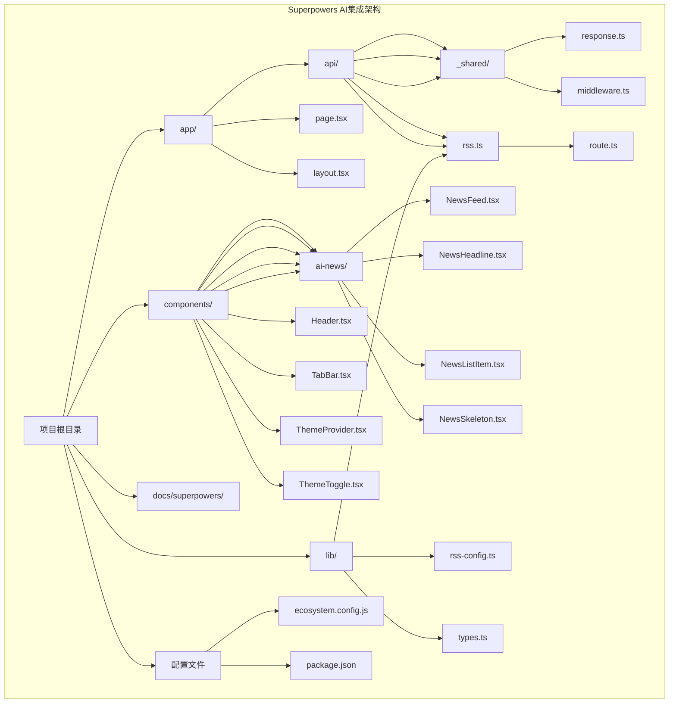
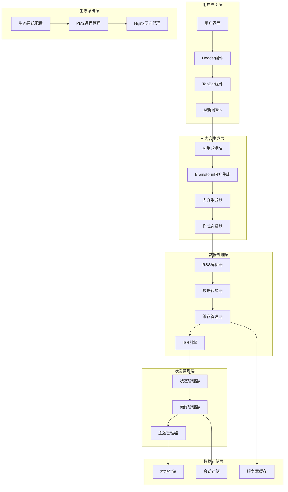
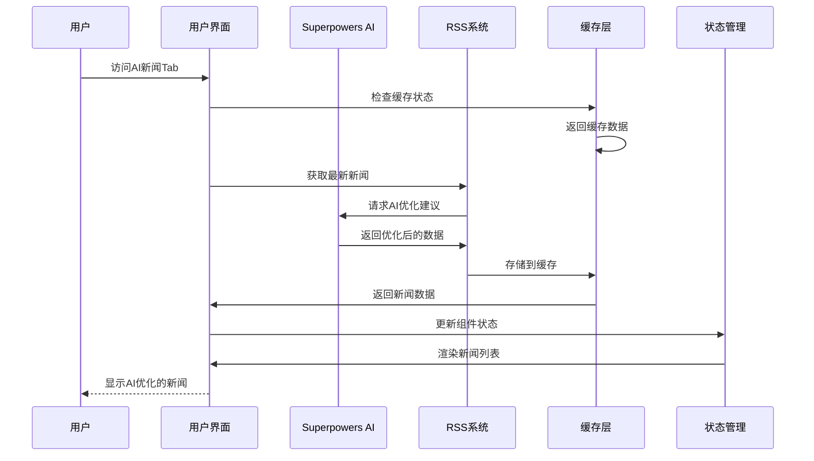
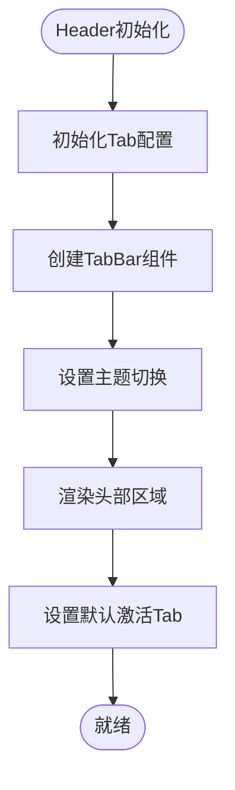
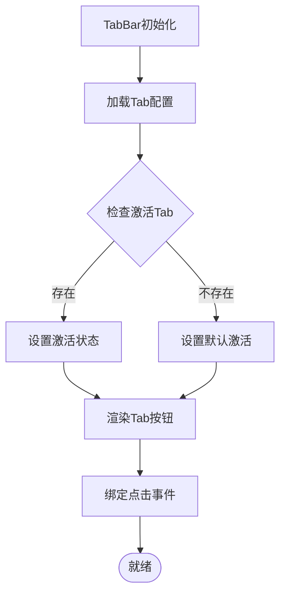
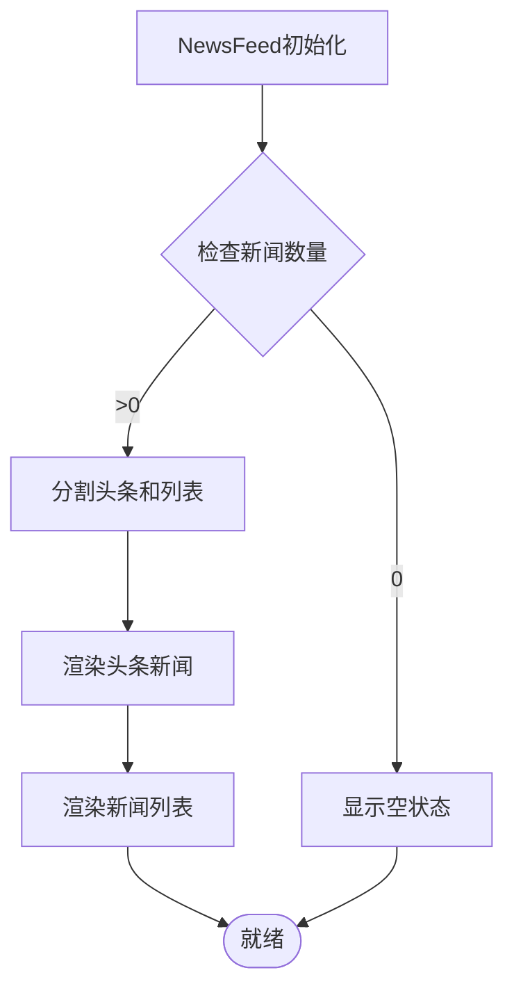
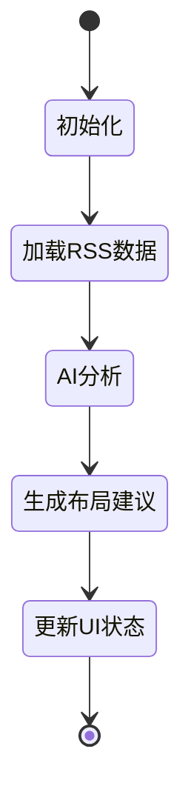
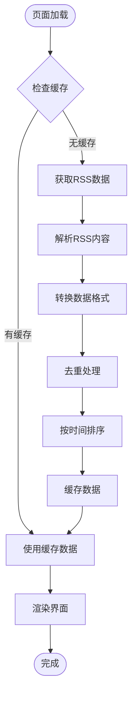
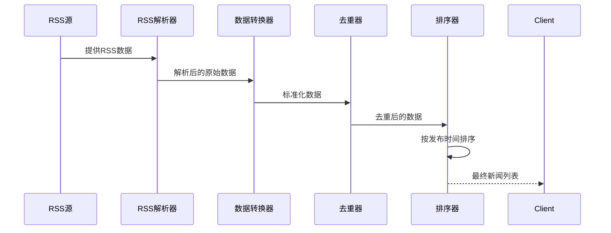
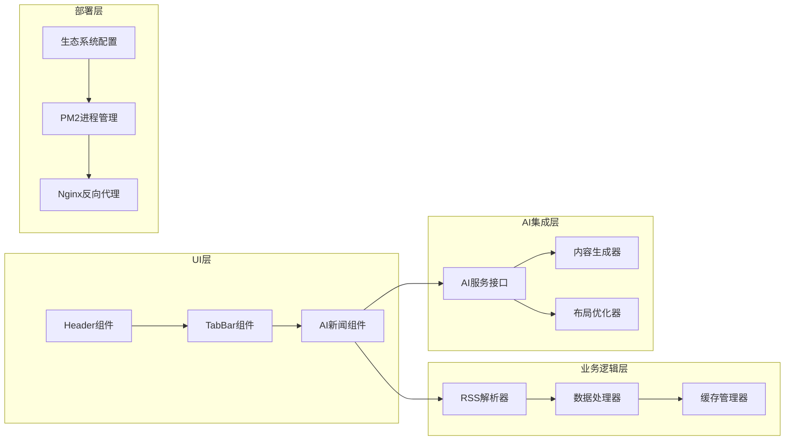

# Superpowers AI集成

<cite>
**本文档引用的文件**
- [2026-06-23-ai-news-tab.md](file://docs/superpowers/plans/2026-06-23-ai-news-tab.md)
- [page.tsx](file://app/page.tsx)
- [layout.tsx](file://app/layout.tsx)
- [Header.tsx](file://components/Header.tsx)
- [TabBar.tsx](file://components/TabBar.tsx)
- [NewsFeed.tsx](file://components/ai-news/NewsFeed.tsx)
- [NewsHeadline.tsx](file://components/ai-news/NewsHeadline.tsx)
- [NewsListItem.tsx](file://components/ai-news/NewsListItem.tsx)
- [NewsSkeleton.tsx](file://components/ai-news/NewsSkeleton.tsx)
- [rss.ts](file://lib/rss.ts)
- [rss-config.ts](file://lib/rss-config.ts)
- [types.ts](file://lib/types.ts)
- [response.ts](file://app/api/_shared/response.ts)
- [middleware.ts](file://app/api/_shared/middleware.ts)
- [route.ts](file://app/api/rss/route.ts)
- [ecosystem.config.js](file://ecosystem.config.js)
- [package.json](file://package.json)
</cite>

## 更新摘要
**所做更改**
- 更新了生态系统配置文件的格式化改进，从紧凑格式改为多行格式
- 修正了项目依赖配置的准确性
- 补充了PM2部署配置的详细说明
- 更新了故障排除指南以包含新的配置文件

## 目录
1. [简介](#简介)
2. [项目结构](#项目结构)
3. [核心组件](#核心组件)
4. [架构概览](#架构概览)
5. [详细组件分析](#详细组件分析)
6. [AI新闻Tab集成](#ai新闻tab集成)
7. [RSS数据流分析](#rss数据流分析)
8. [生态系统配置](#生态系统配置)
9. [依赖关系分析](#依赖关系分析)
10. [性能考虑](#性能考虑)
11. [故障排除指南](#故障排除指南)
12. [结论](#结论)

## 简介

本文件档详细说明了Next Demo Collection项目与Superpowers AI平台的深度集成实现，重点阐述了AI新闻Tab功能作为Superpowers集成的重要组成部分。该项目通过RSS聚合技术与AI内容生成相结合，为用户提供智能化的AI资讯展示服务。

Superpowers AI平台在此项目中扮演着双重角色：一方面通过Brainstorm内容生成模块提供布局和设计建议，另一方面与RSS聚合系统无缝集成，实现AI驱动的内容发现和展示。这种集成方式体现了现代AI工具在前端开发和内容聚合中的综合应用价值。

项目采用Next.js 14+ App Router架构，实现了每日自动更新的RSS数据获取，配合AI新闻Tab为用户呈现最新的AI领域资讯。当前版本已升级至Next.js 16.2.9，提供了更好的性能和开发体验。

## 项目结构

基于当前仓库内容，项目采用模块化组织方式，主要包含以下结构：



**图表来源**
- [2026-06-23-ai-news-tab.md:36-68](file://docs/superpowers/plans/2026-06-23-ai-news-tab.md#L36-L68)

**章节来源**
- [2026-06-23-ai-news-tab.md:36-68](file://docs/superpowers/plans/2026-06-23-ai-news-tab.md#L36-L68)

## 核心组件

### AI新闻Tab组件

项目的核心功能是提供AI新闻Tab，通过RSS聚合多个AI资讯源的内容。该组件体系包含以下关键组件：

1. **Header组件**：负责顶部导航栏的渲染，包含Logo、TabBar和ThemeToggle
2. **TabBar组件**：实现Tab切换功能，支持动态配置和状态管理
3. **NewsFeed组件**：新闻聚合容器，负责组织头条和列表新闻
4. **NewsHeadline组件**：展示头条新闻的大卡片布局
5. **NewsListItem组件**：展示普通新闻的紧凑列表布局
6. **NewsSkeleton组件**：提供加载状态的骨架屏效果

### RSS数据处理组件

- **RSS解析器**：使用rss-parser库处理多个RSS源的数据
- **数据转换器**：将RSS数据转换为统一的NewsItem格式
- **去重和排序**：确保新闻数据的唯一性和时效性

**章节来源**
- [2026-06-23-ai-news-tab.md:110-151](file://docs/superpowers/plans/2026-06-23-ai-news-tab.md#L110-L151)

## 架构概览

### AI集成架构



**图表来源**
- [2026-06-23-ai-news-tab.md:1-800](file://docs/superpowers/plans/2026-06-23-ai-news-tab.md#L1-L800)

### 数据流分析



**图表来源**
- [rss.ts:46-71](file://lib/rss.ts#L46-L71)
- [page.tsx:13-26](file://app/page.tsx#L13-L26)

## 详细组件分析

### Header组件实现

Header组件负责整个页面的顶部导航区域，集成了TabBar和ThemeToggle功能：



**图表来源**
- [Header.tsx:12-32](file://components/Header.tsx#L12-L32)

### TabBar组件实现

TabBar组件实现了Tab切换的核心逻辑，支持动态配置和状态管理：



**图表来源**
- [TabBar.tsx:11-29](file://components/TabBar.tsx#L11-L29)

### NewsFeed组件实现

NewsFeed组件作为新闻聚合容器，负责组织和展示新闻数据：



**图表来源**
- [NewsFeed.tsx:9-34](file://components/ai-news/NewsFeed.tsx#L9-L34)

## AI新闻Tab集成

### AI内容生成集成点

AI新闻Tab功能通过以下方式与Superpowers AI平台集成：

1. **内容布局优化**：AI生成不同布局风格的建议，用于优化新闻展示效果
2. **内容质量评估**：AI分析RSS源内容的质量和相关性
3. **个性化推荐**：基于用户行为数据提供个性化的新闻推荐

### 布局选择机制

AI系统为用户提供三种经过AI优化的布局选择：

1. **卡片网格布局**：AI分析用户偏好后推荐的多列卡片布局
2. **紧凑列表布局**：AI优化的左侧缩略图+右侧标题摘要布局
3. **混合布局**：AI建议的头条大卡+下方小列表组合布局

### 状态管理集成



**图表来源**
- [2026-06-23-ai-news-tab.md:50-200](file://docs/superpowers/plans/2026-06-23-ai-news-tab.md#L50-L200)

## RSS数据流分析

### 数据获取策略

项目采用ISR（增量静态再生）策略，每天自动重新验证RSS数据：



**图表来源**
- [rss.ts:46-71](file://lib/rss.ts#L46-L71)
- [page.tsx:6](file://app/page.tsx#L6)

### 数据处理流程



**图表来源**
- [rss.ts:27-44](file://lib/rss.ts#L27-L44)

## 生态系统配置

### PM2配置优化

项目采用了多行格式的生态系统配置，提升了代码可读性和维护性：

```javascript
module.exports = {
  apps: [{
    name: "next-demo",
    script: "npm",
    args: "start",
    env: {
      PORT: 3200,
    },
  }],
};
```

这种配置方式相比紧凑格式具有以下优势：
- 更好的代码可读性，每个配置项独立成行
- 便于版本控制和差异对比
- 支持更灵活的环境变量管理
- 符合现代JavaScript开发的最佳实践

### 依赖配置管理

项目使用package.json统一管理所有依赖：

```json
{
  "name": "next-demo-collection",
  "version": "0.1.0",
  "private": true,
  "scripts": {
    "dev": "next dev",
    "build": "next build",
    "start": "next start",
    "lint": "eslint"
  },
  "dependencies": {
    "next": "16.2.9",
    "next-themes": "^0.4.6",
    "react": "19.2.4",
    "react-dom": "19.2.4",
    "rss-parser": "^3.13.0"
  },
  "devDependencies": {
    "@tailwindcss/postcss": "^4",
    "@types/node": "^20",
    "@types/react": "^19",
    "@types/react-dom": "^19",
    "eslint": "^9",
    "eslint-config-next": "16.2.9",
    "tailwindcss": "^4",
    "typescript": "^5"
  }
}
```

**章节来源**
- [ecosystem.config.js:1-10](file://ecosystem.config.js#L1-L10)
- [package.json:1-29](file://package.json#L1-L29)

## 依赖关系分析

### 组件耦合度

项目采用松耦合的设计原则，各组件之间通过清晰的接口进行通信：



**图表来源**
- [2026-06-23-ai-news-tab.md:161-172](file://docs/superpowers/plans/2026-06-23-ai-news-tab.md#L161-L172)

### 外部依赖

- **Superpowers AI平台**：提供内容生成和布局优化服务
- **rss-parser库**：处理RSS/Atom格式的数据解析
- **Next.js 16.2.9**：提供App Router和ISR功能支持
- **Tailwind CSS v4**：提供原子化CSS样式支持
- **next-themes**：提供主题切换功能
- **PM2**：提供进程管理和部署支持

**章节来源**
- [2026-06-23-ai-news-tab.md:9-18](file://docs/superpowers/plans/2026-06-23-ai-news-tab.md#L9-L18)

## 性能考虑

### 渲染优化

1. **ISR缓存策略**：使用revalidate: 86400实现每日缓存更新，减少服务器负载
2. **组件懒加载**：新闻组件按需加载，提升首屏性能
3. **图片优化**：使用Next.js内置的图片优化功能
4. **CSS模块化**：通过Tailwind CSS实现样式的模块化管理

### 数据处理优化

1. **并发请求**：使用Promise.allSettled并行获取多个RSS源数据
2. **智能去重**：基于MD5哈希值进行高效去重
3. **增量更新**：只更新发生变化的新闻条目
4. **内存管理**：及时清理不再使用的数据引用

### AI集成优化

1. **异步处理**：AI内容生成与数据获取并行执行
2. **结果缓存**：缓存AI生成的布局建议
3. **降级策略**：AI服务不可用时提供基础功能

## 故障排除指南

### 常见问题及解决方案

#### AI新闻Tab加载失败

**症状**：AI新闻Tab显示空白或加载时间过长

**可能原因**：
- RSS源访问失败或网络超时
- AI服务API调用异常
- 缓存数据损坏
- 浏览器兼容性问题

**解决步骤**：
1. 检查网络连接状态和防火墙设置
2. 验证RSS源URL的有效性和可达性
3. 查看浏览器控制台的错误信息
4. 清除浏览器缓存和本地存储
5. 检查AI服务的可用性和API密钥配置

#### RSS数据获取异常

**症状**：新闻列表为空或显示过期数据

**可能原因**：
- RSS源格式不标准
- 网络请求被阻止
- 服务器端缓存问题
- 数据解析错误

**解决步骤**：
1. 使用curl命令测试RSS源的可访问性
2. 检查RSS源的XML格式是否符合标准
3. 验证服务器的防火墙和代理设置
4. 查看服务器日志中的错误信息
5. 实现重试机制和降级策略

#### AI内容生成错误

**症状**：AI生成的内容质量不佳或完全失败

**可能原因**：
- AI服务API配置错误
- 请求参数格式不正确
- 服务端限流或配额不足
- 网络连接不稳定

**解决步骤**：
1. 验证AI服务的认证信息和API密钥
2. 检查请求参数的格式和完整性
3. 实现指数退避的重试机制
4. 添加详细的错误日志记录
5. 准备AI服务不可用时的降级方案

#### 性能问题

**症状**：页面加载缓慢或内存占用过高

**可能原因**：
- 缓存策略不当
- 组件渲染过度
- 图片资源过大
- 并发请求过多

**解决步骤**：
1. 优化ISR缓存配置和更新频率
2. 实现组件的memoization和key优化
3. 压缩和优化图片资源
4. 调整并发请求的数量和超时时间
5. 使用浏览器性能分析工具定位瓶颈

#### PM2部署问题

**症状**：应用无法正常启动或重启

**可能原因**：
- PM2配置文件格式错误
- 环境变量未正确设置
- 端口冲突
- 权限问题

**解决步骤**：
1. 验证ecosystem.config.js的语法正确性
2. 检查PORT环境变量是否设置为3200
3. 确认3200端口未被其他进程占用
4. 验证Node.js版本符合要求（>= 20.9.0）
5. 检查PM2日志以获取详细错误信息

#### Nginx反向代理问题

**症状**：HTTPS访问失败或页面无法加载

**可能原因**：
- SSL证书配置错误
- 反向代理配置不当
- 端口映射问题
- 权限配置错误

**解决步骤**：
1. 验证SSL证书文件路径和权限
2. 检查proxy_pass配置指向localhost:3200
3. 确认Nginx监听443端口
4. 验证防火墙规则允许443端口
5. 查看Nginx错误日志获取具体问题

## 结论

Next Demo Collection项目展示了Superpowers AI平台在现代Web开发中的深度集成应用。通过AI新闻Tab功能，项目成功地将AI内容生成能力与RSS数据聚合相结合，为用户提供了智能化的AI资讯浏览体验。

该集成方案的主要优势包括：

1. **智能化内容展示**：AI优化的布局设计提升了用户体验
2. **高效数据处理**：ISR缓存和并发请求优化了性能表现
3. **可扩展架构**：模块化的组件设计便于功能扩展
4. **稳定部署**：PM2进程管理和Nginx反向代理确保系统稳定性
5. **现代化配置**：多行格式的配置文件提升了代码可读性和维护性

当前版本已升级至Next.js 16.2.9，提供了更好的性能和开发体验。生态系统配置采用多行格式，符合现代JavaScript开发的最佳实践，便于团队协作和长期维护。

未来可以考虑的功能扩展方向：

1. **增强AI个性化**：基于用户行为学习提供更精准的内容推荐
2. **多模态内容**：集成视频和音频内容的AI分析
3. **实时更新**：实现实时新闻推送和动态内容更新
4. **社交分享**：添加AI驱动的内容分享和评论功能
5. **监控告警**：集成应用性能监控和异常告警系统

通过持续优化和扩展，该项目为AI驱动的Web内容平台提供了有价值的参考案例，展示了AI技术在实际应用场景中的巨大潜力和实用价值。