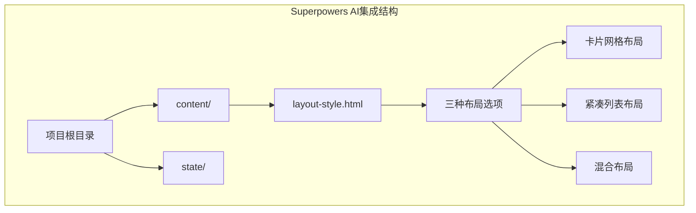
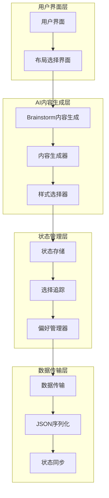
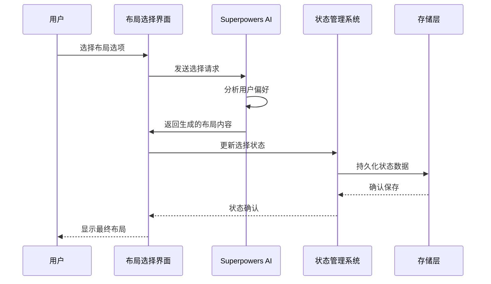
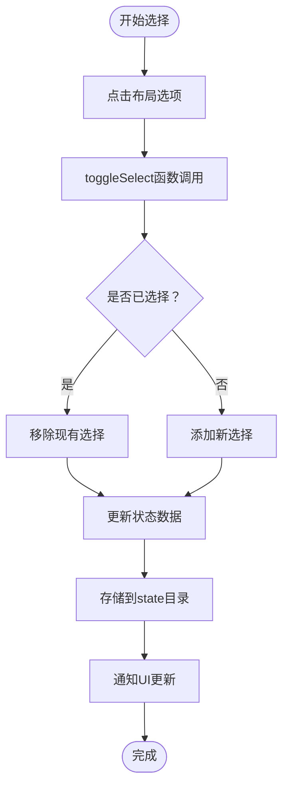
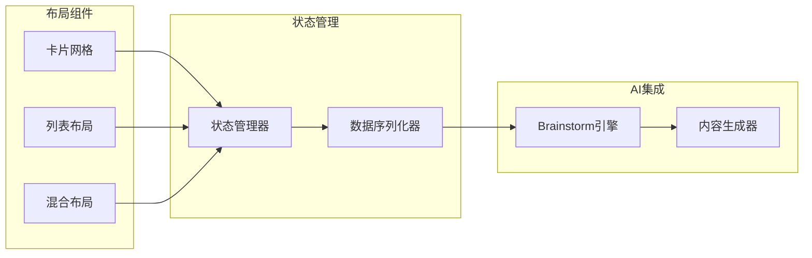

# Superpowers AI集成

<cite>
**本文档引用的文件**
- [layout-style.html](file://.superpowers/brainstorm/1153-1782210686/content/layout-style.html)
</cite>

## 目录
1. [简介](#简介)
2. [项目结构](#项目结构)
3. [核心组件](#核心组件)
4. [架构概览](#架构概览)
5. [详细组件分析](#详细组件分析)
6. [依赖关系分析](#依赖关系分析)
7. [性能考虑](#性能考虑)
8. [故障排除指南](#故障排除指南)
9. [结论](#结论)

## 简介

本文件档详细说明了Next Demo Collection项目与Superpowers AI平台的集成实现，重点关注Brainstorm内容生成模块的集成方式。Superpowers AI是一个强大的AI创作平台，能够根据用户需求自动生成各种类型的内容，包括网页布局、UI设计元素等。

在本项目中，AI系统通过Brainstorm功能模块为用户提供多种新闻布局风格的选择，包括卡片网格、紧凑列表和头条+列表混合布局三种选项。这种集成方式体现了现代AI工具在前端开发中的应用价值。

## 项目结构

基于当前仓库内容，项目采用模块化组织方式，主要包含以下结构：

**图表来源**
- [layout-style.html:1-173](file://.superpowers/brainstorm/1153-1782210686/content/layout-style.html#L1-L173)

**章节来源**
- [.superpowers/brainstorm/1153-1782210686/content/layout-style.html:1-173](file://.superpowers/brainstorm/1153-1782210686/content/layout-style.html#L1-L173)

## 核心组件

### 布局选择组件

项目的核心功能是提供三种不同的新闻布局风格供用户选择：

1. **卡片网格布局 (Option A)**：多列卡片布局，适合信息密度高的场景
2. **紧凑列表布局 (Option B)**：左侧缩略图+右侧标题摘要的列表形式
3. **混合布局 (Option C)**：头条大卡+下方小列表的组合形式

每个布局选项都包含：
- 视觉预览图（通过CSS样式模拟）
- 功能描述文本
- 数据属性标识符用于状态管理

**章节来源**
- [.superpowers/brainstorm/1153-1782210686/content/layout-style.html:5-173](file://.superpowers/brainstorm/1153-1782210686/content/layout-style.html#L5-L173)

## 架构概览

### AI集成架构

**图表来源**
- [layout-style.html:1-173](file://.superpowers/brainstorm/1153-1782210686/content/layout-style.html#L1-L173)

### 数据流分析

**图表来源**
- [layout-style.html:6-115](file://.superpowers/brainstorm/1153-1782210686/content/layout-style.html#L6-L115)

## 详细组件分析

### 布局选择逻辑

#### 卡片网格布局 (Option A)

该布局采用响应式网格系统，通过CSS Grid实现多列布局。每个卡片包含：
- 标题区域（模拟标题文本）
- 摘要区域（模拟内容摘要）
- 来源标签和时间信息
- 边框和圆角样式

#### 紧凑列表布局 (Option B)

此布局采用Flexbox设计，实现左右分栏：
- 左侧固定尺寸缩略图
- 右侧弹性标题摘要区域
- 垂直间距控制
- 对齐和间隙优化

#### 混合布局 (Option C)

结合头条和列表的优势：
- 顶部大卡片突出显示重要信息
- 底部小列表展示相关内容
- 层次分明的信息架构
- 空间利用效率最大化

**章节来源**
- [.superpowers/brainstorm/1153-1782210686/content/layout-style.html:5-173](file://.superpowers/brainstorm/1153-1782210686/content/layout-style.html#L5-L173)

### 状态管理机制

虽然当前仓库未包含完整的JavaScript实现，但从HTML结构可以看出状态管理的关键要素：

**图表来源**
- [layout-style.html:6-115](file://.superpowers/brainstorm/1153-1782210686/content/layout-style.html#L6-L115)

## 依赖关系分析

### 组件耦合度

从现有代码分析，各组件之间的耦合关系相对松散：

**图表来源**
- [layout-style.html:1-173](file://.superpowers/brainstorm/1153-1782210686/content/layout-style.html#L1-L173)

### 外部依赖

- **Superpowers AI平台**：提供内容生成和布局建议
- **浏览器环境**：支持JavaScript DOM操作
- **文件系统**：用于状态数据的持久化存储

**章节来源**
- [.superpowers/brainstorm/1153-1782210686/content/layout-style.html:1-173](file://.superpowers/brainstorm/1153-1782210686/content/layout-style.html#L1-L173)

## 性能考虑

### 渲染优化

1. **CSS优先策略**：使用纯CSS实现视觉效果，减少JavaScript计算开销
2. **响应式设计**：适配不同屏幕尺寸，提升用户体验
3. **懒加载机制**：图片资源按需加载，优化首屏性能

### 状态管理优化

1. **增量更新**：仅更新变化的状态部分
2. **防抖处理**：避免频繁的状态切换导致的性能问题
3. **内存管理**：及时清理不需要的状态数据

## 故障排除指南

### 常见问题及解决方案

#### 布局选择无响应

**症状**：点击布局选项后无任何反应

**可能原因**：
- toggleSelect函数未定义或未正确加载
- JavaScript执行错误阻止了后续操作
- DOM元素绑定失败

**解决步骤**：
1. 检查浏览器控制台是否有JavaScript错误
2. 验证toggleSelect函数的定义和作用域
3. 确认DOM元素的data-choice属性正确设置
4. 检查事件监听器是否正常绑定

#### 状态数据丢失

**症状**：刷新页面后布局选择状态消失

**可能原因**：
- 状态存储路径配置错误
- 文件权限问题
- 存储机制实现缺失

**解决步骤**：
1. 验证state目录的可写权限
2. 检查状态数据的序列化格式
3. 确认存储和读取逻辑的完整性
4. 添加错误处理和重试机制

#### AI内容生成异常

**症状**：无法获取AI生成的布局建议

**可能原因**：
- Superpowers AI服务连接失败
- API密钥配置错误
- 网络请求超时

**解决步骤**：
1. 检查网络连接状态
2. 验证AI服务的可用性
3. 确认API配置参数正确
4. 实现重试和降级策略

## 结论

Next Demo Collection项目展示了Superpowers AI平台在实际开发中的有效集成。通过Brainstorm内容生成模块，项目实现了智能化的布局选择功能，为用户提供了三种经过AI优化的布局方案。

该集成方案的主要优势包括：
- **用户体验优化**：智能布局建议提升用户满意度
- **开发效率提升**：AI辅助设计减少重复劳动
- **内容质量保证**：基于AI的布局选择更具专业性

未来可以考虑的功能扩展：
- 增加更多布局类型的AI生成
- 实现个性化布局偏好学习
- 添加实时协作编辑功能
- 集成更多的AI创意工具

通过持续优化和扩展，该项目为AI驱动的Web开发提供了有价值的参考案例。