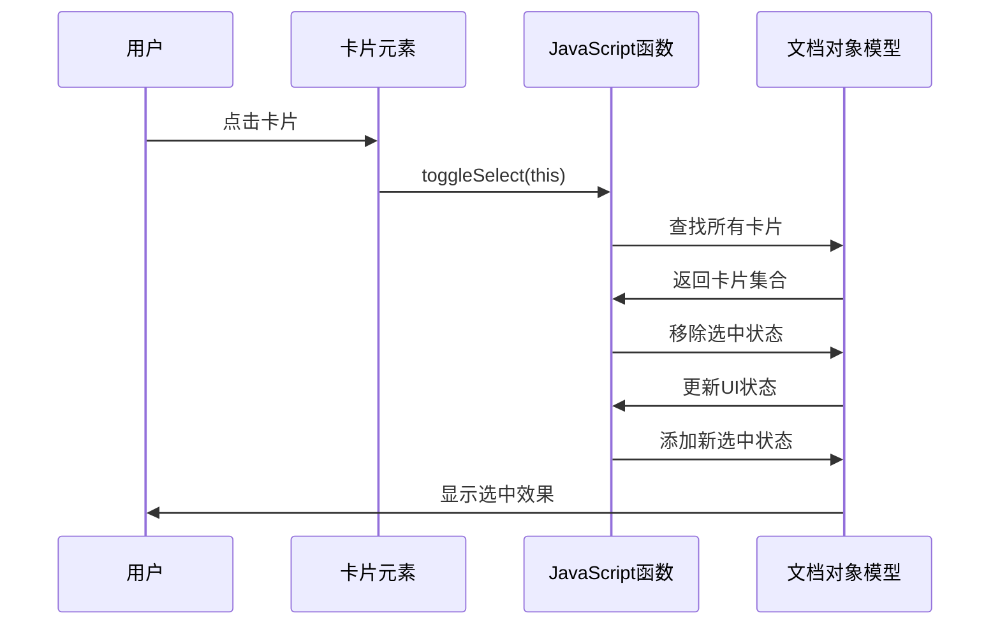
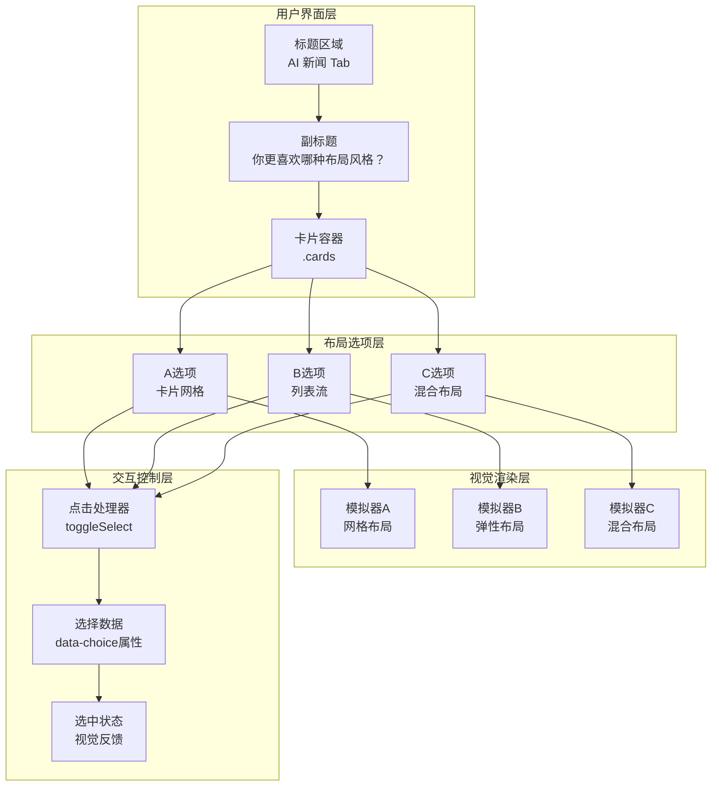
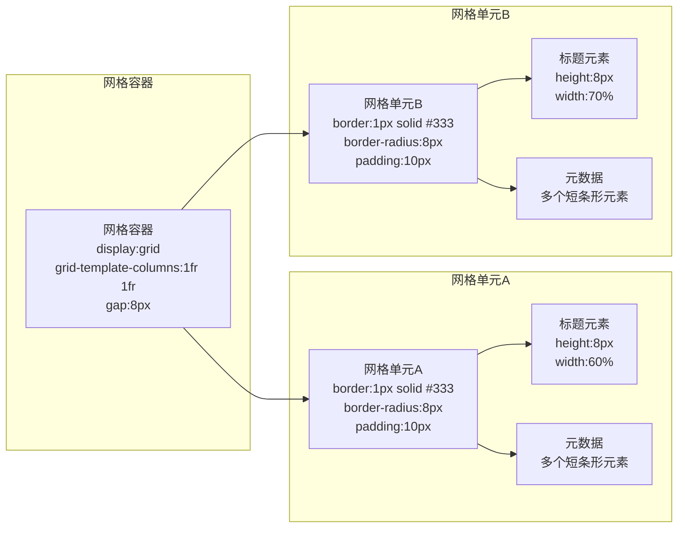
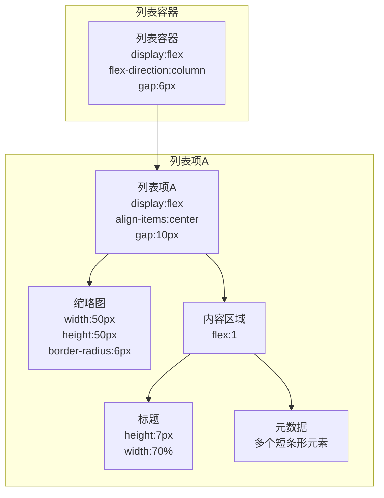
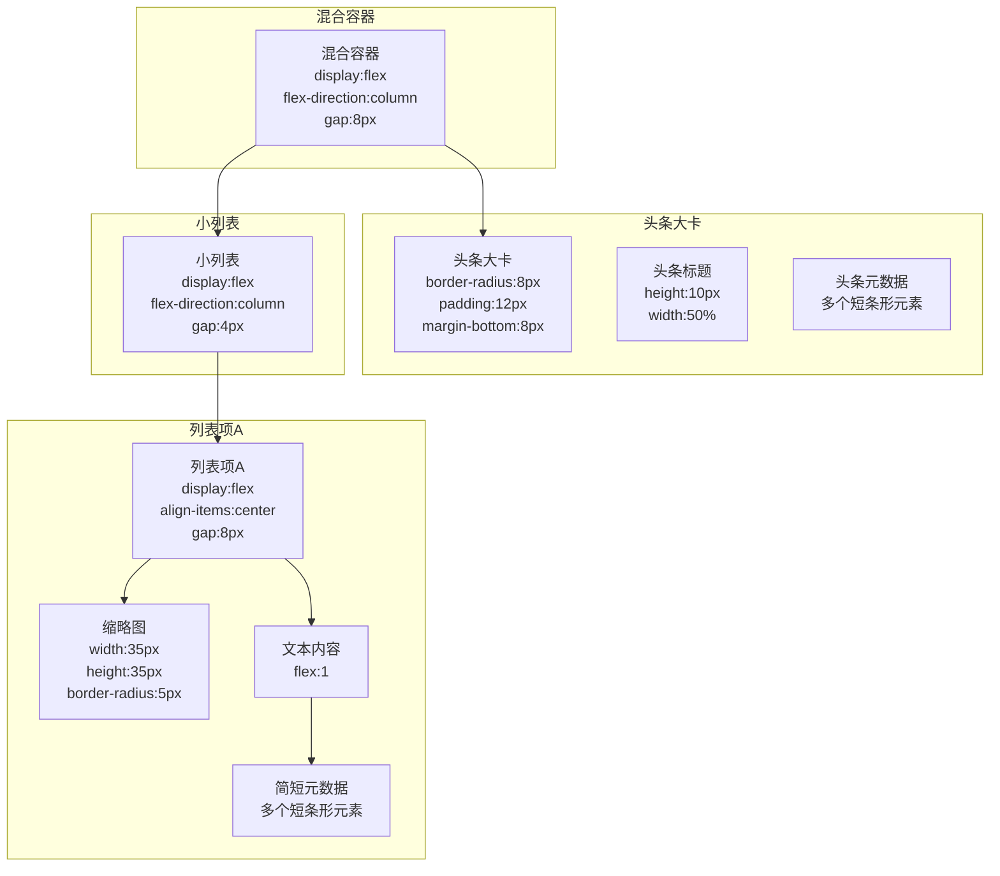
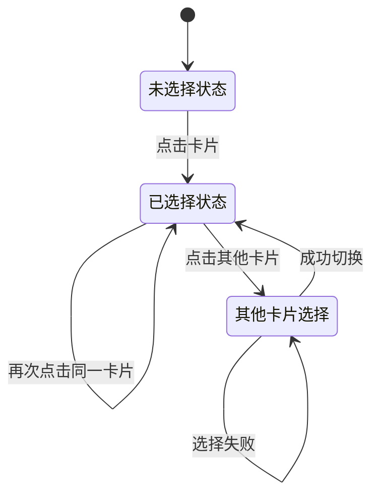

# 布局风格详解

<cite>
**本文档引用的文件**
- [layout-style.html](file://.superpowers/brainstorm/1153-1782210686/content/layout-style.html)
</cite>

## 目录
1. [简介](#简介)
2. [项目结构](#项目结构)
3. [核心组件](#核心组件)
4. [架构概览](#架构概览)
5. [详细组件分析](#详细组件分析)
6. [依赖关系分析](#依赖关系分析)
7. [性能考虑](#性能考虑)
8. [故障排除指南](#故障排除指南)
9. [结论](#结论)

## 简介

Next Demo Collection项目展示了三种不同的新闻布局风格，专为AI新闻Tab设计。该项目通过直观的可视化界面让用户选择最适合的布局方式，重点关注信息密度与阅读体验之间的平衡。三种布局风格分别为：卡片网格布局(A选项)、列表流布局(B选项)和混合布局(C选项)。

## 项目结构

该项目采用极简的单文件架构，所有内容都集中在单一的HTML文件中：

```mermaid
graph TB
subgraph "项目根目录"
HTML[layout-style.html<br/>主页面文件]
end
subgraph "布局组件"
CARDS[卡片容器<br/>.cards]
CARD_A[卡片A<br/>.card[data-choice="a"]]
CARD_B[卡片B<br/>.card[data-choice="b"]]
CARD_C[卡片C<br/>.card[data-choice="c"]]
end
subgraph "视觉元素"
MOCKUP[模拟器<br/>.mockup]
GRID[网格布局<br/>display:grid]
FLEX[弹性布局<br/>display:flex]
BODY[卡片主体<br/>.card-body]
end
HTML --> CARDS
CARDS --> CARD_A
CARDS --> CARD_B
CARDS --> CARD_C
CARD_A --> MOCKUP
CARD_B --> MOCKUP
CARD_C --> MOCKUP
MOCKUP --> GRID
MOCKUP --> FLEX
CARD_A --> BODY
CARD_B --> BODY
CARD_C --> BODY
```

**图表数据源**
- [layout-style.html:4-173](file://.superpowers/brainstorm/1153-1782210686/content/layout-style.html#L4-L173)

**章节数据源**
- [layout-style.html:1-173](file://.superpowers/brainstorm/1153-1782210686/content/layout-style.html#L1-L173)

## 核心组件

### 卡片容器系统

项目使用统一的卡片容器系统来展示三种不同的布局风格：

- **主容器**: `.cards` - 包含所有布局选项的容器
- **卡片单元**: `.card` - 每个布局选项的独立卡片
- **选择标识**: `data-choice` 属性 - 标识A、B、C三个选项
- **交互事件**: `onclick` 事件 - 触发布局选择逻辑

### 布局选择机制

每个卡片都实现了点击选择功能，通过 `toggleSelect(this)` 函数实现布局切换：



**图表数据源**
- [layout-style.html:6](file://.superpowers/brainstorm/1153-1782210686/content/layout-style.html#L6)
- [layout-style.html:58](file://.superpowers/brainstorm/1153-1782210686/content/layout-style.html#L58)
- [layout-style.html:118](file://.superpowers/brainstorm/1153-1782210686/content/layout-style.html#L118)

**章节数据源**
- [layout-style.html:4-173](file://.superpowers/brainstorm/1153-1782210686/content/layout-style.html#L4-L173)

## 架构概览

### 布局系统架构



**图表数据源**
- [layout-style.html:1-173](file://.superpowers/brainstorm/1153-1782210686/content/layout-style.html#L1-L173)

## 详细组件分析

### A选项：卡片网格布局

#### 结构特征

卡片网格布局采用两列等宽的网格系统，每个网格单元代表一条新闻信息：



**图表数据源**
- [layout-style.html:10-47](file://.superpowers/brainstorm/1153-1782210686/content/layout-style.html#L10-L47)

#### 视觉特性

- **信息密度**: 高密度显示，适合快速浏览大量新闻
- **视觉层次**: 清晰的网格边界和内边距区分不同新闻
- **响应式**: 自适应网格布局，根据屏幕宽度调整列数
- **色彩方案**: 使用渐变灰色调(#444到#666)，营造专业感

#### 适用场景

- 新闻聚合平台
- 内容发现应用
- 信息密集型仪表板
- 快速预览多个内容项

**章节数据源**
- [layout-style.html:5-55](file://.superpowers/brainstorm/1153-1782210686/content/layout-style.html#L5-L55)

### B选项：列表流布局

#### 结构特征

列表流布局采用垂直弹性布局，每条新闻以左右分栏的形式呈现：



**图表数据源**
- [layout-style.html:62-107](file://.superpowers/brainstorm/1153-1782210686/content/layout-style.html#L62-L107)

#### 视觉特性

- **阅读友好**: 左侧固定缩略图，右侧内容区域，符合阅读习惯
- **空间效率**: 紧凑的垂直排列，节省横向空间
- **视觉连贯**: 统一的间距和对齐方式，形成流畅的阅读节奏
- **层级清晰**: 缩略图作为视觉焦点，内容作为信息载体

#### 适用场景

- 资讯类App
- 社交媒体Feed
- 个人博客列表
- 电商产品列表

**章节数据源**
- [layout-style.html:57-115](file://.superpowers/brainstorm/1153-1782210686/content/layout-style.html#L57-L115)

### C选项：混合布局

#### 结构特征

混合布局结合了头条突出展示和列表紧凑排列的优势：



**图表数据源**
- [layout-style.html:121-164](file://.superpowers/brainstorm/1153-1782210686/content/layout-style.html#L121-L164)

#### 视觉特性

- **层次分明**: 头条大卡突出重要信息，小列表展示次要内容
- **空间优化**: 头条使用更大空间，列表使用紧凑布局
- **视觉对比**: 大小卡片形成明显的视觉层次
- **信息平衡**: 既保证重点信息的突出，又保持整体的信息密度

#### 适用场景

- 新闻门户首页
- 内容聚合平台
- 推荐系统界面
- 个性化内容展示

**章节数据源**
- [layout-style.html:117-172](file://.superpowers/brainstorm/1153-1782210686/content/layout-style.html#L117-L172)

## 依赖关系分析

### 组件间依赖

```mermaid
graph LR
subgraph "外部依赖"
JAVASCRIPT[JavaScript<br/>toggleSelect函数]
CSS[CSS样式<br/>网格和弹性布局]
HTML[HTML结构<br/>语义化标记]
end
subgraph "内部组件"
CARDS[卡片容器<br/>.cards]
CARD_A[卡片A<br/>.card[data-choice="a"]]
CARD_B[卡片B<br/>.card[data-choice="b"]]
CARD_C[卡片C<br/>.card[data-choice="c"]]
MOCKUPS[模拟器<br/>.mockup]
TITLES[标题<br/>h3元素]
DESCRIPTIONS[描述<br/>p元素]
end
JAVASCRIPT --> CARDS
JAVASCRIPT --> CARD_A
JAVASCRIPT --> CARD_B
JAVASCRIPT --> CARD_C
CSS --> MOCKUPS
CSS --> CARDS
CSS --> CARD_A
CSS --> CARD_B
CSS --> CARD_C
HTML --> TITLES
HTML --> DESCRIPTIONS
HTML --> MOCKUPS
```

**图表数据源**
- [layout-style.html:6](file://.superpowers/brainstorm/1153-1782210686/content/layout-style.html#L6)
- [layout-style.html:58](file://.superpowers/brainstorm/1782210686/content/layout-style.html#L58)
- [layout-style.html:118](file://.superpowers/brainstorm/1153-1782210686/content/layout-style.html#L118)

### 状态管理机制



**图表数据源**
- [layout-style.html:6](file://.superpowers/brainstorm/1153-1782210686/content/layout-style.html#L6)
- [layout-style.html:58](file://.superpowers/brainstorm/1153-1782210686/content/layout-style.html#L58)
- [layout-style.html:118](file://.superpowers/brainstorm/1153-1782210686/content/layout-style.html#L118)

**章节数据源**
- [layout-style.html:4-173](file://.superpowers/brainstorm/1153-1782210686/content/layout-style.html#L4-L173)

## 性能考虑

### 渲染性能

- **轻量级结构**: 所有布局都使用简单的div元素和内联样式，减少DOM复杂度
- **CSS原生布局**: 使用CSS Grid和Flexbox，利用浏览器原生渲染引擎
- **最小化重绘**: 布局切换仅涉及样式类的添加和移除，避免复杂的DOM操作

### 交互性能

- **事件委托**: 单一的点击处理函数处理所有卡片选择
- **即时反馈**: 选中状态切换具有即时视觉反馈
- **内存效率**: 无持久状态存储，页面刷新后状态重置

## 故障排除指南

### 常见问题

1. **布局不显示**
   - 检查浏览器是否支持CSS Grid和Flexbox
   - 确认网络连接正常，资源加载完整

2. **点击无响应**
   - 验证JavaScript函数 `toggleSelect` 是否正确加载
   - 检查浏览器控制台是否有JavaScript错误

3. **样式异常**
   - 确认CSS样式是否正确应用
   - 检查浏览器兼容性问题

### 调试建议

- 使用浏览器开发者工具检查元素状态
- 验证CSS选择器是否正确匹配目标元素
- 检查JavaScript控制台的错误信息

## 结论

Next Demo Collection项目成功展示了三种不同布局风格的设计理念和实现方式。每种布局都有其独特的视觉特性和适用场景：

- **卡片网格布局**适合需要高信息密度和快速浏览的场景
- **列表流布局**适合注重阅读体验和内容深度的场景  
- **混合布局**适合需要突出重点内容同时保持整体效率的场景

项目通过简洁的HTML结构和内联样式实现了直观的布局展示，为开发者提供了清晰的参考模板。虽然当前版本主要是静态展示，但其设计理念可以轻松扩展到实际的新闻应用开发中。