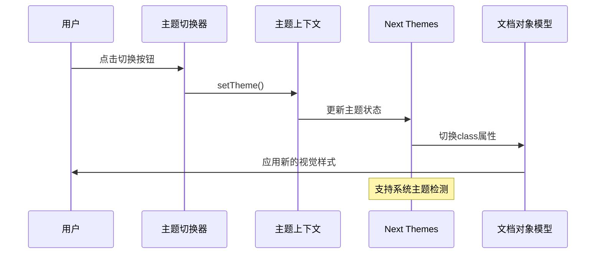
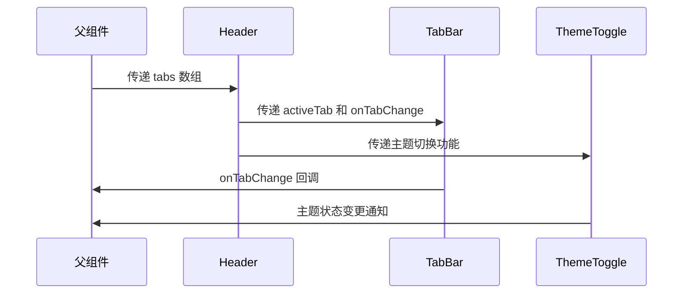
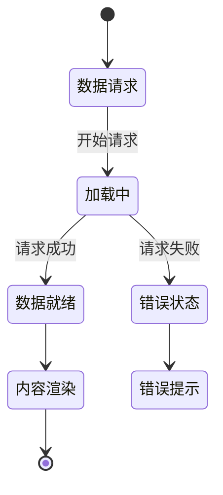
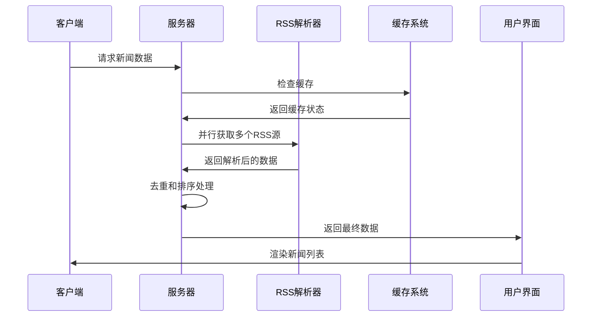
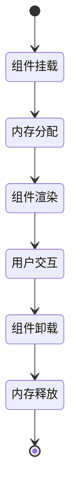

# 布局风格详解

<cite>
**本文档引用的文件**
- [package.json](file://package.json)
- [app/layout.tsx](file://app/layout.tsx)
- [app/page.tsx](file://app/page.tsx)
- [app/globals.css](file://app/globals.css)
- [components/ThemeProvider.tsx](file://components/ThemeProvider.tsx)
- [components/ThemeToggle.tsx](file://components/ThemeToggle.tsx)
- [components/Header.tsx](file://components/Header.tsx)
- [components/TabBar.tsx](file://components/TabBar.tsx)
- [components/ai-news/NewsFeed.tsx](file://components/ai-news/NewsFeed.tsx)
- [components/ai-news/NewsHeadline.tsx](file://components/ai-news/NewsHeadline.tsx)
- [components/ai-news/NewsListItem.tsx](file://components/ai-news/NewsListItem.tsx)
- [components/ai-news/NewsSkeleton.tsx](file://components/ai-news/NewsSkeleton.tsx)
- [lib/types.ts](file://lib/types.ts)
- [lib/rss.ts](file://lib/rss.ts)
- [lib/rss-config.ts](file://lib/rss-config.ts)
</cite>

## 更新摘要
**所做更改**
- 新增主题系统架构分析，包括 next-themes 集成和暗色模式支持
- 更新组件化架构说明，详细分析 AI 新闻组件体系
- 新增响应式设计实现分析，涵盖 Tailwind CSS 和移动端适配
- 补充 RSS 数据获取和新闻聚合流程
- 更新视觉设计规范，包括颜色系统和字体配置

## 目录
1. [简介](#简介)
2. [项目架构概览](#项目架构概览)
3. [主题系统与视觉设计](#主题系统与视觉设计)
4. [组件化架构分析](#组件化架构分析)
5. [AI 新闻布局实现](#ai-新闻布局实现)
6. [响应式设计与用户体验](#响应式设计与用户体验)
7. [数据流与状态管理](#数据流与状态管理)
8. [性能优化策略](#性能优化策略)
9. [扩展与定制指南](#扩展与定制指南)
10. [故障排除与调试](#故障排除与调试)
11. [总结](#总结)

## 简介

Next Demo Collection 项目是一个基于 Next.js 的现代化新闻聚合应用，专注于展示三种不同的新闻布局风格。项目采用组件化架构设计，集成了完整的主题系统、响应式布局和数据获取机制。通过直观的可视化界面，用户可以选择最适合的布局方式来浏览 AI 新闻内容。

项目的核心特色包括：
- **多布局支持**：卡片网格、列表流和混合布局三种展示方式
- **主题系统**：完整的明暗主题切换机制
- **组件化架构**：模块化的组件设计，便于维护和扩展
- **响应式设计**：适配各种设备尺寸的布局系统
- **数据集成**：从多个 RSS 源聚合新闻内容

## 项目架构概览

### 技术栈与依赖

项目采用现代前端技术栈构建，主要依赖包括：

```mermaid
graph TB
subgraph "核心框架"
NEXTJS[Next.js 16.2.9<br/>React 19.2.4]
TAILWIND[Tailwind CSS v4<br/>实用优先的CSS框架]
TYPESCRIPT[TypeScript 5<br/>类型安全的JavaScript]
END
subgraph "主题系统"
NEXT_THEMES[next-themes 0.4.6<br/>主题切换库]
THEME_CONTEXT[主题上下文<br/>状态管理]
END
subgraph "数据处理"
RSS_PARSER[rss-parser 3.13.0<br/>RSS解析器]
CRYPTO[Node.js Crypto<br/>ID生成]
END
subgraph "开发工具"
ESLINT[ESLint 9<br/>代码质量]
POSTCSS[PostCSS 4<br/>CSS处理]
TS_CONFIG[TypeScript配置<br/>严格类型检查]
END
NEXTJS --> TAILWIND
NEXTJS --> TYPESCRIPT
NEXTJS --> NEXT_THEMES
NEXT_THEMES --> THEME_CONTEXT
RSS_PARSER --> CRYPTO
```

**图表数据源**
- [package.json:11-27](file://package.json#L11-L27)

### 应用结构组织

```mermaid
graph TD
subgraph "应用入口"
ROOT_LAYOUT[app/layout.tsx<br/>根布局配置]
PAGE[app/page.tsx<br/>主页组件]
GLOBALS_CSS[app/globals.css<br/>全局样式]
END
subgraph "组件层"
HEADER[components/Header.tsx<br/>头部导航]
TAB_BAR[components/TabBar.tsx<br/>标签切换]
THEME_PROVIDER[components/ThemeProvider.tsx<br/>主题提供者]
THEME_TOGGLE[components/ThemeToggle.tsx<br/>主题切换器]
END
subgraph "业务组件"
NEWS_FEED[components/ai-news/NewsFeed.tsx<br/>新闻聚合容器]
NEWS_HEADLINE[components/ai-news/NewsHeadline.tsx<br/>头条卡片]
NEWS_LIST_ITEM[components/ai-news/NewsListItem.tsx<br/>列表条目]
NEWS_SKELETON[components/ai-news/NewsSkeleton.tsx<br/>骨架屏]
END
subgraph "数据层"
TYPES[lib/types.ts<br/>类型定义]
RSS[lib/rss.ts<br/>RSS解析]
RSS_CONFIG[lib/rss-config.ts<br/>RSS配置]
END
ROOT_LAYOUT --> PAGE
PAGE --> HEADER
HEADER --> TAB_BAR
HEADER --> THEME_TOGGLE
PAGE --> NEWS_FEED
NEWS_FEED --> NEWS_HEADLINE
NEWS_FEED --> NEWS_LIST_ITEM
PAGE --> NEWS_SKELETON
PAGE --> RSS
RSS --> TYPES
RSS --> RSS_CONFIG
```

**图表数据源**
- [app/layout.tsx:28-43](file://app/layout.tsx#L28-L43)
- [app/page.tsx:19-32](file://app/page.tsx#L19-L32)

**章节数据源**
- [package.json:1-29](file://package.json#L1-L29)
- [app/layout.tsx:1-44](file://app/layout.tsx#L1-L44)
- [app/page.tsx:1-33](file://app/page.tsx#L1-L33)

## 主题系统与视觉设计

### 主题架构设计

项目采用 next-themes 库实现完整的主题管理系统，支持明暗模式自动切换和用户偏好保存。



**图表数据源**
- [components/ThemeToggle.tsx:26-41](file://components/ThemeToggle.tsx#L26-L41)
- [components/ThemeProvider.tsx:11-16](file://components/ThemeProvider.tsx#L11-L16)

### 颜色系统与变量

项目使用 CSS 自定义属性实现灵活的颜色管理：

| 颜色变量 | 明色模式值 | 暗色模式值 | 用途 |
|---------|-----------|-----------|------|
| `--foreground` | `#171717` | `#ededed` | 文本主色 |
| `--background` | `#ffffff` | `#0a0a0a` | 背景主色 |
| `--primary` | `#3b82f6` | `#60a5fa` | 主要品牌色 |
| `--secondary` | `#f3f4f6` | `#1f2937` | 次要背景色 |
| `--success` | `#10b981` | `#34d399` | 成功状态色 |

### 字体系统配置

项目集成了 Geist 字体家族，提供无衬线和等宽两种字体变体：

```mermaid
graph LR
subgraph "字体配置"
GEIST_SANS[Geist Sans<br/>无衬线字体<br/>变量: --font-geist-sans]
GEIST_MONO[Geist Mono<br/>等宽字体<br/>变量: --font-geist-mono]
END
subgraph "应用范围"
BODY[body<br/>默认字体]
CODE[pre, code<br/>代码字体]
CUSTOM[自定义组件<br/>字体变量]
END
GEIST_SANS --> BODY
GEIST_MONO --> CODE
GEIST_SANS --> CUSTOM
```

**图表数据源**
- [app/layout.tsx:10-20](file://app/layout.tsx#L10-L20)
- [app/globals.css:5-19](file://app/globals.css#L5-L19)

**章节数据源**
- [components/ThemeProvider.tsx:1-18](file://components/ThemeProvider.tsx#L1-L18)
- [components/ThemeToggle.tsx:1-43](file://components/ThemeToggle.tsx#L1-L43)
- [app/globals.css:1-20](file://app/globals.css#L1-L20)
- [app/layout.tsx:1-44](file://app/layout.tsx#L1-L44)

## 组件化架构分析

### 组件层次结构

项目采用清晰的组件分层架构，从基础 UI 组件到业务组件层层递进：

```mermaid
graph TD
subgraph "基础组件层"
BUTTON[Button<br/>通用按钮]
INPUT[Input<br/>输入框]
CARD[Card<br/>卡片容器]
END
subgraph "导航组件层"
HEADER[Header<br/>头部导航]
TAB_BAR[TabBar<br/>标签栏]
THEME_TOGGLE[ThemeToggle<br/>主题切换]
END
subgraph "业务组件层"
NEWS_FEED[NewsFeed<br/>新闻聚合]
NEWS_HEADLINE[NewsHeadline<br/>头条卡片]
NEWS_LIST_ITEM[NewsListItem<br/>列表条目]
NEWS_SKELETON[NewsSkeleton<br/>骨架屏]
END
subgraph "页面组件层"
HOME[Home<br/>主页]
LAYOUT[RootLayout<br/>根布局]
END
LAYOUT --> HOME
HOME --> HEADER
HEADER --> TAB_BAR
HEADER --> THEME_TOGGLE
HOME --> NEWS_FEED
NEWS_FEED --> NEWS_HEADLINE
NEWS_FEED --> NEWS_LIST_ITEM
HOME --> NEWS_SKELETON
```

**图表数据源**
- [components/Header.tsx:17-36](file://components/Header.tsx#L17-L36)
- [components/TabBar.tsx:18-36](file://components/TabBar.tsx#L18-L36)
- [components/ai-news/NewsFeed.tsx:15-42](file://components/ai-news/NewsFeed.tsx#L15-L42)

### 组件通信模式

组件间通过 props 和回调函数进行通信，实现松耦合的设计：



**图表数据源**
- [components/Header.tsx:17-36](file://components/Header.tsx#L17-L36)
- [components/TabBar.tsx:18-36](file://components/TabBar.tsx#L18-L36)

**章节数据源**
- [components/Header.tsx:1-38](file://components/Header.tsx#L1-L38)
- [components/TabBar.tsx:1-37](file://components/TabBar.tsx#L1-L37)

## AI 新闻布局实现

### 布局策略架构

项目实现了三种不同的新闻布局策略，每种都有独特的视觉特性和适用场景：

```mermaid
graph TB
subgraph "布局策略"
GRID_LAYOUT[网格布局<br/>卡片网格<br/>适合信息密度高的场景]
LIST_LAYOUT[列表布局<br/>流式排列<br/>适合阅读体验优先的场景]
MIXED_LAYOUT[混合布局<br/>头条+列表<br/>适合内容层次分明的场景]
END
subgraph "组件实现"
NEWS_FEED[NewsFeed<br/>聚合容器]
NEWS_HEADLINE[NewsHeadline<br/>头条组件]
NEWS_LIST_ITEM[NewsListItem<br/>列表组件]
NEWS_SKELETON[NewsSkeleton<br/>加载态]
END
subgraph "数据流"
RSS_DATA[RSS 数据]
PROCESSING[数据处理<br/>去重+排序]
DISPLAY[布局渲染]
END
RSS_DATA --> PROCESSING --> DISPLAY
DISPLAY --> NEWS_FEED
NEWS_FEED --> NEWS_HEADLINE
NEWS_FEED --> NEWS_LIST_ITEM
DISPLAY --> NEWS_SKELETON
```

**图表数据源**
- [components/ai-news/NewsFeed.tsx:15-42](file://components/ai-news/NewsFeed.tsx#L15-L42)
- [components/ai-news/NewsHeadline.tsx:26-62](file://components/ai-news/NewsHeadline.tsx#L26-L62)
- [components/ai-news/NewsListItem.tsx:26-55](file://components/ai-news/NewsListItem.tsx#L26-L55)

### A选项：头条突出布局

头条突出布局将最重要的新闻以大卡片形式展示，其余新闻以紧凑列表形式排列：

#### 头条卡片特性

- **视觉冲击**：全宽大卡片，突出重要信息
- **多媒体支持**：支持新闻配图，悬停时有缩放动画
- **信息完整**：包含标题、摘要、来源和发布时间
- **交互友好**：悬停时边框变色，提供视觉反馈

#### 列表条目特性

- **紧凑设计**：左侧来源图标，右侧信息内容
- **信息精简**：标题和摘要适度截断，保持可读性
- **时间优化**：使用相对时间格式，如"刚刚"、"2h"、"3d"
- **响应式适配**：在小屏幕上自动调整布局

**章节数据源**
- [components/ai-news/NewsFeed.tsx:15-42](file://components/ai-news/NewsFeed.tsx#L15-L42)
- [components/ai-news/NewsHeadline.tsx:1-63](file://components/ai-news/NewsHeadline.tsx#L1-L63)
- [components/ai-news/NewsListItem.tsx:1-56](file://components/ai-news/NewsListItem.tsx#L1-L56)

### B选项：列表流布局

列表流布局采用垂直滚动的新闻列表，每条新闻都包含完整的视觉元素：

#### 布局特点

- **阅读友好**：符合传统阅读习惯的垂直排列
- **空间效率**：充分利用垂直空间，减少横向占用
- **视觉层次**：通过边框、阴影和颜色区分不同新闻
- **交互一致**：所有新闻条目具有一致的交互行为

#### 设计规范

- **间距控制**：使用 `space-y-2` 实现条目间的垂直间距
- **边框样式**：默认浅色边框，悬停时变为蓝色强调
- **圆角设计**：12px 圆角提供柔和的视觉感受
- **过渡动画**：平滑的颜色和变换过渡效果

**章节数据源**
- [components/ai-news/NewsListItem.tsx:26-55](file://components/ai-news/NewsListItem.tsx#L26-L55)

### C选项：网格卡片布局

网格卡片布局将新闻以卡片形式排列，适合需要高信息密度展示的场景：

#### 网格系统

- **自适应列数**：根据屏幕宽度自动调整列数
- **等宽设计**：所有卡片保持相同的宽度比例
- **间距统一**：使用 `gap-4` 实现均匀的间距分布
- **响应式断点**：在不同设备上实现最优的网格布局

#### 视觉设计

- **卡片样式**：圆角边框、浅色背景、微妙阴影
- **内容层次**：标题、摘要、元数据按重要性排列
- **颜色搭配**：使用品牌色作为强调色，保持整体和谐
- **动画效果**：悬停时的平滑过渡提升用户体验

**章节数据源**
- [components/ai-news/NewsHeadline.tsx:26-62](file://components/ai-news/NewsHeadline.tsx#L26-L62)

## 响应式设计与用户体验

### 响应式断点系统

项目采用 Tailwind CSS 的响应式设计系统，支持多种设备尺寸：

```mermaid
graph LR
subgraph "移动优先设计"
MOBILE[移动端<br/>sm: ≥640px<br/>默认样式]
TABLET[平板端<br/>md: ≥768px<br/>中等布局]
DESKTOP[桌面端<br/>lg: ≥1024px<br/>宽屏布局]
XL[超宽屏<br/>xl: ≥1280px<br/>最大化布局]
XXL[极大屏<br/>2xl: ≥1536px<br/>特殊优化]
END
subgraph "关键断点"
SM[sm: 640px<br/>手机竖屏]
MD[md: 768px<br/>平板竖屏]
LG[lg: 1024px<br/>小桌面]
XL[xl: 1280px<br/>标准桌面]
XXL[2xl: 1536px<br/>大桌面]
END
MOBILE --> TABLET --> DESKTOP --> XL --> XXL
```

**图表数据源**
- [app/page.tsx:23-31](file://app/page.tsx#L23-L31)

### 交互体验优化

#### 加载状态管理

项目实现了完整的加载状态处理机制：



#### 用户反馈机制

- **悬停效果**：所有可交互元素都有明确的悬停反馈
- **状态指示**：加载状态使用骨架屏提供视觉指引
- **错误处理**：网络错误时显示友好的错误信息
- **无障碍支持**：完整的 ARIA 标签和键盘导航支持

**章节数据源**
- [components/ai-news/NewsSkeleton.tsx:7-39](file://components/ai-news/NewsSkeleton.tsx#L7-L39)
- [components/ai-news/NewsFeed.tsx:17-27](file://components/ai-news/NewsFeed.tsx#L17-L27)

## 数据流与状态管理

### RSS 数据获取流程

项目实现了高效的数据获取和处理机制：



**图表数据源**
- [lib/rss.ts:62-86](file://lib/rss.ts#L62-L86)

### 数据处理管道

#### 并行数据获取

项目使用 `Promise.allSettled` 实现多个 RSS 源的并行获取，确保单个源失败不影响整体数据获取：

```mermaid
graph LR
subgraph "RSS源配置"
SOURCE1[TechCrunch AI<br/>RSS源1]
SOURCE2[36氪<br/>RSS源2]
SOURCE3[IT之家<br/>RSS源3]
END
subgraph "并行处理"
PARALLEL[Promise.allSettled<br/>并发获取]
MERGE[数据合并]
DEDUPE[重复数据去重]
SORT[按时间排序]
END
subgraph "输出结果"
RESULT[最终新闻列表]
END
SOURCE1 --> PARALLEL
SOURCE2 --> PARALLEL
SOURCE3 --> PARALLEL
PARALLEL --> MERGE --> DEDUPE --> SORT --> RESULT
```

**图表数据源**
- [lib/rss.ts:63-85](file://lib/rss.ts#L63-L85)

#### 数据转换规则

- **ID 生成**：基于 URL 的 MD5 哈希生成唯一标识符
- **内容清理**：移除 HTML 标签，保留纯文本内容
- **图片提取**：从 HTML 内容中提取第一张图片作为封面
- **时间格式化**：统一转换为 ISO 8601 格式

**章节数据源**
- [lib/rss.ts:18-56](file://lib/rss.ts#L18-L56)
- [lib/rss.ts:62-86](file://lib/rss.ts#L62-L86)
- [lib/rss-config.ts:7-20](file://lib/rss-config.ts#L7-L20)

## 性能优化策略

### 渲染性能优化

#### 组件懒加载

项目采用 React 的 Suspense 和动态导入实现组件懒加载，减少初始包体积：

```mermaid
graph TD
subgraph "组件加载策略"
LAZY_LOADING[懒加载组件]
CODE_SPLITTING[代码分割]
PRELOADING[预加载策略]
END
subgraph "性能指标"
BUNDLE_SIZE[包体积优化]
LOAD_TIME[加载时间]
INTERACTION[交互延迟]
END
LAZY_LOADING --> BUNDLE_SIZE
CODE_SPLITTING --> LOAD_TIME
PRELOADING --> INTERACTION
```

#### 服务器端渲染优化

- **ISR 配置**：使用 `revalidate` 实现增量静态再生
- **缓存策略**：合理设置缓存过期时间
- **预渲染**：热门页面提前生成静态 HTML

### 内存管理

#### 组件卸载清理



#### 事件监听器管理

- **自动清理**：组件卸载时自动移除事件监听器
- **防抖处理**：高频事件使用防抖优化性能
- **虚拟滚动**：长列表使用虚拟滚动减少 DOM 元素

**章节数据源**
- [app/page.tsx:10](file://app/page.tsx#L10)
- [components/Header.tsx:17-36](file://components/Header.tsx#L17-L36)

## 扩展与定制指南

### 新增布局风格

要添加新的布局风格，需要遵循以下步骤：

1. **创建布局组件**：在 `components/ai-news/` 目录下创建新的布局组件
2. **实现布局逻辑**：编写布局渲染逻辑和样式定义
3. **更新类型定义**：在 `lib/types.ts` 中添加新的布局类型
4. **集成到主界面**：在 `NewsFeed` 组件中添加新布局的渲染逻辑

### 主题定制

#### 颜色系统扩展

```typescript
// 在 app/globals.css 中添加新的颜色变量
:root {
  --brand-primary: #3b82f6;
  --brand-secondary: #10b981;
  --brand-accent: #f59e0b;
}

.dark {
  --brand-primary: #60a5fa;
  --brand-secondary: #34d399;
  --brand-accent: #fbbf24;
}
```

#### 字体系统扩展

```typescript
// 在 app/layout.tsx 中添加新的字体变体
const geistSans = Geist({
  variable: '--font-geist-sans',
  subsets: ['latin'],
});

const geistDisplay = Geist({
  variable: '--font-geist-display',
  subsets: ['latin'],
});
```

### 组件扩展

#### 新增业务组件

```typescript
// 创建新的业务组件
interface NewComponentProps {
  data: NewsItem[];
  onAction?: (item: NewsItem) => void;
}

export function NewComponent({ data, onAction }: NewComponentProps) {
  return (
    <div className="new-component">
      {data.map(item => (
        <div 
          key={item.id}
          className="component-item"
          onClick={() => onAction?.(item)}
        >
          {item.title}
        </div>
      ))}
    </div>
  );
}
```

#### 状态管理模式

```typescript
// 使用 React Context 管理全局状态
import { createContext, useContext, useReducer } from 'react';

interface AppState {
  theme: 'light' | 'dark';
  activeTab: string;
  news: NewsItem[];
}

const AppContext = createContext<AppState>({
  theme: 'dark',
  activeTab: 'ai-news',
  news: [],
});

export function useAppState() {
  return useContext(AppContext);
}
```

**章节数据源**
- [lib/types.ts:6-28](file://lib/types.ts#L6-L28)
- [app/globals.css:5-19](file://app/globals.css#L5-L19)
- [app/layout.tsx:10-20](file://app/layout.tsx#L10-L20)

## 故障排除与调试

### 常见问题诊断

#### 主题切换问题

**症状**：主题切换无效或状态不一致

**解决方案**：
1. 检查 `next-themes` 配置是否正确
2. 验证 `ThemeProvider` 是否正确包裹应用
3. 确认 `attribute="class"` 设置是否正确

#### 数据加载问题

**症状**：新闻数据无法加载或显示空白

**排查步骤**：
1. 检查网络连接和 RSS 源可用性
2. 查看浏览器控制台的错误信息
3. 验证 RSS 配置是否正确
4. 检查服务器端渲染日志

#### 响应式布局问题

**症状**：移动端显示异常或布局错乱

**解决方法**：
1. 检查 Tailwind CSS 配置是否正确
2. 验证断点设置是否符合预期
3. 确认媒体查询是否正确应用
4. 测试不同设备的显示效果

### 调试工具推荐

#### 开发工具

- **React DevTools**：检查组件树和状态变化
- **Next.js Profiler**：分析渲染性能
- **Chrome DevTools**：调试 CSS 和 JavaScript
- **Network Monitor**：监控网络请求和响应

#### 性能监控

```javascript
// 添加性能监控代码
if (process.env.NODE_ENV === 'development') {
  console.time('NewsFeed Render');
  // 组件渲染逻辑
  console.timeEnd('NewsFeed Render');
}
```

**章节数据源**
- [components/ThemeToggle.tsx:16-18](file://components/ThemeToggle.tsx#L16-L18)
- [lib/rss.ts:52-55](file://lib/rss.ts#L52-L55)

## 总结

Next Demo Collection 项目成功展示了现代 React 应用的最佳实践，通过组件化架构、主题系统和响应式设计的有机结合，为用户提供了优秀的新闻浏览体验。

### 核心优势

1. **架构清晰**：模块化的组件设计便于维护和扩展
2. **用户体验**：完整的主题系统和响应式布局提升使用体验
3. **性能优化**：合理的数据处理和渲染优化策略
4. **可扩展性**：清晰的架构为未来功能扩展奠定基础

### 技术亮点

- **主题系统**：基于 next-themes 的完整主题切换机制
- **组件化**：清晰的组件层次和通信模式
- **响应式**：适配多设备的灵活布局系统
- **数据处理**：高效的 RSS 数据获取和处理流程

### 发展方向

项目为未来的功能扩展提供了良好的基础，包括但不限于：
- 更多布局风格的实现
- 个性化推荐算法的集成
- 离线缓存和 PWA 支持
- 多语言国际化支持

通过持续的优化和迭代，Next Demo Collection 将继续为用户提供优质的新闻浏览体验，并成为 React 生态系统中的优秀实践案例。