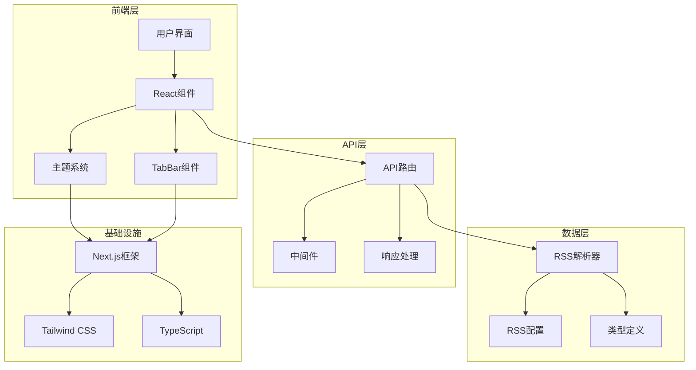
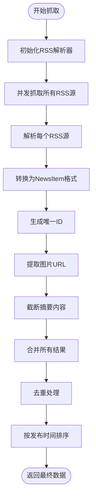
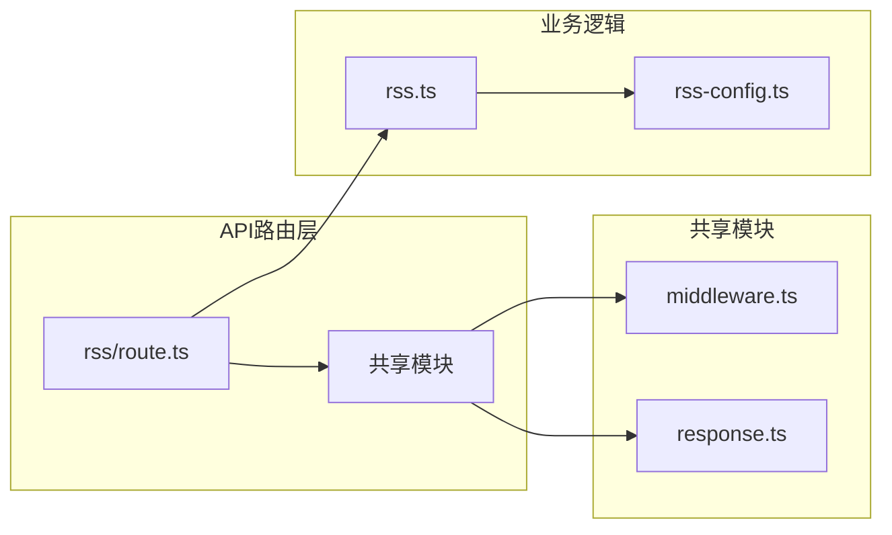
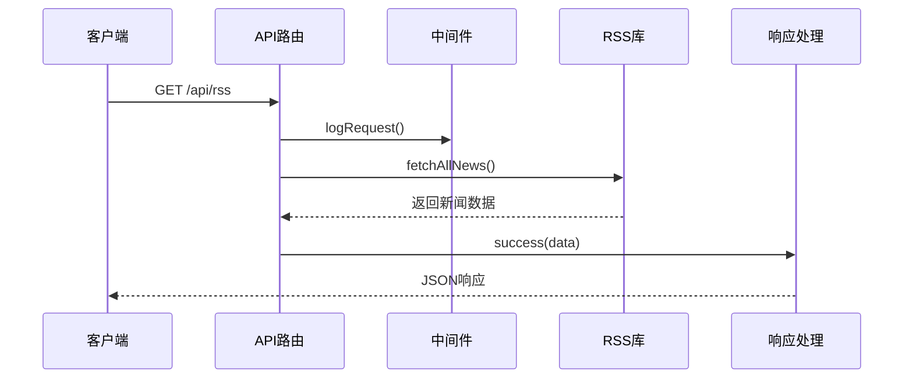
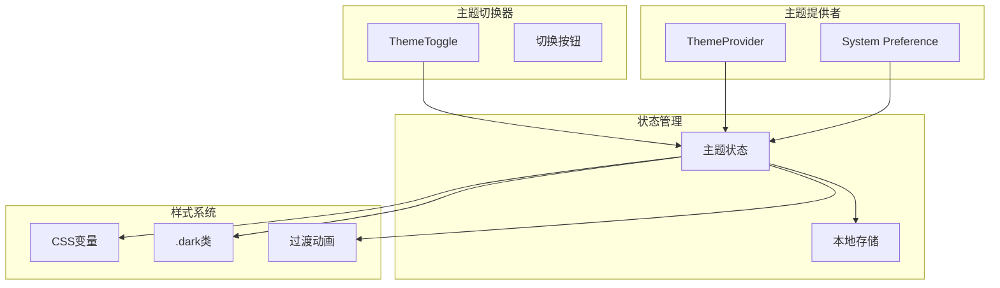

# 快速开始

<cite>
**本文档引用的文件**
- [package.json](file://package.json)
- [app/layout.tsx](file://app/layout.tsx)
- [app/page.tsx](file://app/page.tsx)
- [app/globals.css](file://app/globals.css)
- [components/ThemeProvider.tsx](file://components/ThemeProvider.tsx)
- [components/ThemeToggle.tsx](file://components/ThemeToggle.tsx)
- [components/TabBar.tsx](file://components/TabBar.tsx)
- [app/api/rss/route.ts](file://app/api/rss/route.ts)
- [lib/rss.ts](file://lib/rss.ts)
- [lib/rss-config.ts](file://lib/rss-config.ts)
- [lib/types.ts](file://lib/types.ts)
- [app/api/_shared/middleware.ts](file://app/api/_shared/middleware.ts)
- [app/api/_shared/response.ts](file://app/api/_shared/response.ts)
- [next.config.ts](file://next.config.ts)
- [tsconfig.json](file://tsconfig.json)
</cite>

## 更新摘要
**所做更改**
- 新增RSS新闻聚合功能的完整实现指南
- 添加API路由和中间件的详细说明
- 更新主题切换系统的使用方法
- 扩展TabBar组件的集成指导
- 完善项目初始化和功能验证流程

## 目录
1. [简介](#简介)
2. [项目要求](#项目要求)
3. [安装步骤](#安装步骤)
4. [核心功能](#核心功能)
5. [RSS新闻功能](#rss新闻功能)
6. [API路由系统](#api路由系统)
7. [主题切换系统](#主题切换系统)
8. [TabBar组件](#tabbar组件)
9. [项目配置](#项目配置)
10. [功能验证](#功能验证)
11. [常见使用场景](#常见使用场景)
12. [最佳实践](#最佳实践)
13. [故障排除](#故障排除)

## 简介

Next Demo Collection 是一个基于 Next.js 16 和 Superpowers AI 平台构建的现代化演示项目。该项目不仅提供多种新闻布局风格的选择界面，还集成了完整的RSS新闻聚合功能、API路由系统、主题切换机制和TabBar组件，为开发者提供了一个功能丰富且易于扩展的开发基础。

项目的核心价值在于：
- **RSS新闻聚合**：自动从多个新闻源抓取并整合最新AI相关新闻
- **现代化API架构**：基于Next.js App Router的API路由系统
- **主题切换功能**：支持明暗主题的无缝切换
- **组件化设计**：可复用的TabBar和主题切换组件
- **TypeScript支持**：完整的类型安全开发体验

## 项目要求

在开始之前，请确保您的开发环境满足以下要求：

- Node.js 版本：18.17.0 或更高版本
- npm 版本：8.0.0 或更高版本
- Next.js：16.2.9
- React：19.2.4
- TypeScript：^5

**章节来源**
- [package.json:1-29](file://package.json#L1-L29)

## 安装步骤

### 步骤1：克隆项目

```bash
git clone <项目仓库地址>
cd next-demo-collection
```

### 步骤2：安装依赖

```bash
npm install
```

### 步骤3：启动开发服务器

```bash
npm run dev
```

默认情况下，应用将在 `http://localhost:3000` 上启动。

### 步骤4：验证安装

打开浏览器访问 `http://localhost:3000`，您应该看到项目的欢迎页面。

**章节来源**
- [package.json:5-10](file://package.json#L5-L10)

## 核心功能

### 项目架构概览



**图表来源**
- [app/layout.tsx:21-35](file://app/layout.tsx#L21-L35)
- [components/ThemeProvider.tsx:6-12](file://components/ThemeProvider.tsx#L6-L12)

## RSS新闻功能

### 功能概述

RSS新闻功能是项目的核心特性之一，它能够自动从多个预配置的新闻源抓取最新的AI相关新闻，并提供统一的数据格式输出。

### 配置管理

RSS源配置位于 `lib/rss-config.ts` 文件中：

```typescript
export const RSS_SOURCES: RssSource[] = [
  {
    name: "TechCrunch AI",
    url: "https://techcrunch.com/category/artificial-intelligence/feed/",
  },
  {
    name: "机器之心",
    url: "https://www.jiqizhixin.com/rss",
  },
];
```

### 数据模型

新闻项的数据结构定义如下：

```typescript
export interface NewsItem {
  id: string;
  title: string;
  summary: string;
  source: string;
  sourceIcon?: string;
  url: string;
  imageUrl?: string;
  publishedAt: string;
}

export interface RssSource {
  name: string;
  url: string;
}
```

### 抓取逻辑

RSS抓取功能由 `lib/rss.ts` 中的 `fetchAllNews()` 函数实现：



**图表来源**
- [lib/rss.ts:46-70](file://lib/rss.ts#L46-L70)

**章节来源**
- [lib/rss-config.ts:1-13](file://lib/rss-config.ts#L1-L13)
- [lib/types.ts:1-21](file://lib/types.ts#L1-L21)
- [lib/rss.ts:1-71](file://lib/rss.ts#L1-L71)

## API路由系统

### 路由结构

项目采用Next.js App Router的API路由系统，RSS相关的API路由位于 `app/api/rss/route.ts`：



**图表来源**
- [app/api/rss/route.ts:1-22](file://app/api/rss/route.ts#L1-L22)

### 请求处理流程



**图表来源**
- [app/api/rss/route.ts:6-17](file://app/api/rss/route.ts#L6-L17)

### CORS配置

API路由系统内置了完整的CORS支持：

| 头部名称 | 值 |
|---------|-----|
| Access-Control-Allow-Origin | * |
| Access-Control-Allow-Methods | GET, POST, OPTIONS |
| Access-Control-Allow-Headers | Content-Type |

**章节来源**
- [app/api/rss/route.ts:1-22](file://app/api/rss/route.ts#L1-L22)
- [app/api/_shared/middleware.ts:1-25](file://app/api/_shared/middleware.ts#L1-L25)
- [app/api/_shared/response.ts:1-27](file://app/api/_shared/response.ts#L1-L27)

## 主题切换系统

### 系统架构

主题切换系统基于 `next-themes` 库实现，提供明暗主题的无缝切换体验：



**图表来源**
- [components/ThemeProvider.tsx:6-12](file://components/ThemeProvider.tsx#L6-L12)
- [components/ThemeToggle.tsx:6-35](file://components/ThemeToggle.tsx#L6-L35)

### 主题切换组件

`ThemeToggle` 组件提供了直观的主题切换接口：

```typescript
export function ThemeToggle() {
  const { theme, setTheme } = useTheme();
  // ... 实现细节
}
```

组件特性：
- **响应式图标**：根据当前主题显示不同的图标
- **无障碍支持**：包含aria-label属性
- **平滑过渡**：CSS过渡动画提供流畅的切换体验
- **状态同步**：与系统主题偏好保持同步

### 全局样式配置

主题相关的全局样式定义在 `app/globals.css` 中：

```css
:root {
  --foreground: #171717;
  --background: #ffffff;
}

.dark {
  --foreground: #ededed;
  --background: #0a0a0a;
}
```

**章节来源**
- [components/ThemeProvider.tsx:1-13](file://components/ThemeProvider.tsx#L1-L13)
- [components/ThemeToggle.tsx:1-36](file://components/ThemeToggle.tsx#L1-L36)
- [app/globals.css:1-18](file://app/globals.css#L1-L18)

## TabBar组件

### 组件设计

TabBar组件是一个高度可复用的导航组件，支持动态标签配置和状态管理：

```typescript
interface TabBarProps {
  tabs: TabConfig[];
  activeTab: string;
  onTabChange: (tabId: string) => void;
}
```

### 使用示例

```typescript
const tabs: TabConfig[] = [
  { id: 'home', label: '首页' },
  { id: 'news', label: '新闻' },
  { id: 'about', label: '关于' }
];

<TabBar 
  tabs={tabs} 
  activeTab={activeTab} 
  onTabChange={handleTabChange} 
/>
```

### 样式特性

TabBar组件采用Tailwind CSS实现，具有以下样式特性：
- **响应式设计**：在不同屏幕尺寸下自动调整布局
- **悬停效果**：提供平滑的颜色过渡动画
- **选中状态**：明确的视觉反馈标识当前激活的标签
- **深色模式支持**：完全适配深色主题

**章节来源**
- [components/TabBar.tsx:1-30](file://components/TabBar.tsx#L1-L30)
- [lib/types.ts:17-21](file://lib/types.ts#L17-L21)

## 项目配置

### Next.js配置

项目的基础配置位于 `next.config.ts`：

```typescript
const nextConfig: NextConfig = {
  /* config options here */
};

export default nextConfig;
```

### TypeScript配置

TypeScript配置位于 `tsconfig.json`，支持路径映射和严格模式：

```json
{
  "compilerOptions": {
    "paths": {
      "@/*": ["./*"]
    }
  }
}
```

### Tailwind CSS集成

项目使用Tailwind CSS作为主要的样式解决方案，配置文件位于根目录。

**章节来源**
- [next.config.ts:1-8](file://next.config.ts#L1-L8)
- [tsconfig.json:1-35](file://tsconfig.json#L1-L35)

## 功能验证

### 验证RSS功能

1. **启动应用**：`npm run dev`
2. **访问API端点**：`http://localhost:3000/api/rss`
3. **检查响应格式**：
   ```json
   {
     "code": 200,
     "message": "success",
     "data": [...]
   }
   ```

### 验证主题切换

1. **查看主题切换按钮**：在页面右上角找到太阳/月亮图标
2. **切换主题**：点击按钮验证明暗主题切换
3. **检查持久化**：刷新页面后主题状态保持不变

### 验证TabBar组件

1. **创建测试页面**：在 `app/page.tsx` 中集成TabBar
2. **配置标签**：设置多个测试标签
3. **验证交互**：点击不同标签检查状态变化

**章节来源**
- [app/api/rss/route.ts:6-17](file://app/api/rss/route.ts#L6-L17)
- [components/ThemeToggle.tsx:18-34](file://components/ThemeToggle.tsx#L18-L34)

## 常见使用场景

### 场景1：新闻聚合仪表板

```typescript
// 在页面组件中使用
import { fetchAllNews } from '@/lib/rss';

export default async function NewsDashboard() {
  const news = await fetchAllNews();
  return (
    <div>
      {news.map(item => (
        <NewsCard key={item.id} item={item} />
      ))}
    </div>
  );
}
```

### 场景2：主题感知的应用

```typescript
// 在组件中使用主题
import { useTheme } from 'next-themes';

export function ThemedComponent() {
  const { theme } = useTheme();
  
  return (
    <div className={theme === 'dark' ? 'dark' : ''}>
      {/* 组件内容 */}
    </div>
  );
}
```

### 场景3：动态导航栏

```typescript
// 使用TabBar创建动态导航
const navigationTabs = [
  { id: 'dashboard', label: '仪表板' },
  { id: 'analytics', label: '分析' },
  { id: 'settings', label: '设置' }
];

<TabBar 
  tabs={navigationTabs}
  activeTab={currentTab}
  onTabChange={setCurrentTab}
/>
```

## 最佳实践

### 1. API路由设计

- **错误处理**：始终使用 `try-catch` 包装异步操作
- **CORS配置**：确保正确的跨域头设置
- **日志记录**：使用 `logRequest` 函数记录API调用
- **响应格式**：统一使用 `success` 和 `error` 辅助函数

### 2. 主题系统使用

- **Provider位置**：将 `ThemeProvider` 放置在应用根组件
- **默认主题**：设置合理的默认主题值
- **系统偏好**：启用系统主题偏好检测
- **性能优化**：避免不必要的主题切换

### 3. 组件设计

- **类型安全**：为所有组件props定义明确的类型
- **可复用性**：设计通用的组件接口
- **样式隔离**：使用Tailwind CSS实现样式隔离
- **无障碍**：确保组件的无障碍支持

### 4. 性能优化

- **懒加载**：对大型组件使用React.lazy
- **代码分割**：利用Next.js的自动代码分割
- **缓存策略**：合理设置API响应缓存
- **资源优化**：压缩静态资源和图片

## 故障排除

### 常见问题及解决方案

#### 问题1：RSS抓取失败

**症状**：API返回错误或空数据  
**可能原因**：
- 网络连接问题
- RSS源不可访问
- 解析器超时

**解决方法**：
1. 检查网络连接
2. 验证RSS源URL的有效性
3. 查看控制台错误日志
4. 调整超时时间设置

#### 问题2：主题切换无效

**症状**：点击主题切换按钮无反应  
**可能原因**：
- `next-themes` 未正确安装
- Provider未正确配置
- 浏览器不支持CSS变量

**解决方法**：
1. 确认依赖已安装：`npm install next-themes`
2. 检查 `ThemeProvider` 的嵌套层级
3. 验证CSS变量的定义
4. 测试不同浏览器的兼容性

#### 问题3：API CORS错误

**症状**：浏览器控制台出现CORS错误  
**可能原因**：
- CORS头未正确设置
- 预检请求处理不当
- 跨域配置不匹配

**解决方法**：
1. 检查 `withCors` 函数的实现
2. 验证 `OPTIONS` 方法的处理
3. 确认请求头的正确性
4. 测试不同域名的访问

#### 问题4：TypeScript编译错误

**症状**：TypeScript编译失败  
**可能原因**：
- 类型定义不匹配
- 路径映射配置错误
- 严格模式下的类型检查

**解决方法**：
1. 检查 `tsconfig.json` 的配置
2. 验证路径映射的正确性
3. 检查类型定义的完整性
4. 调整严格模式设置

**章节来源**
- [lib/rss.ts:40-44](file://lib/rss.ts#L40-L44)
- [components/ThemeProvider.tsx:8](file://components/ThemeProvider.tsx#L8)
- [app/api/_shared/middleware.ts:3-8](file://app/api/_shared/middleware.ts#L3-L8)