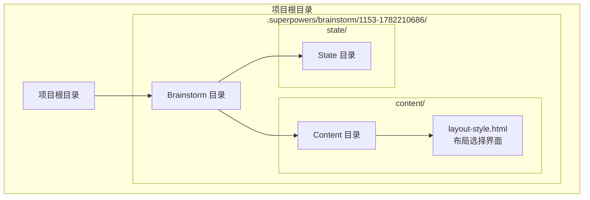
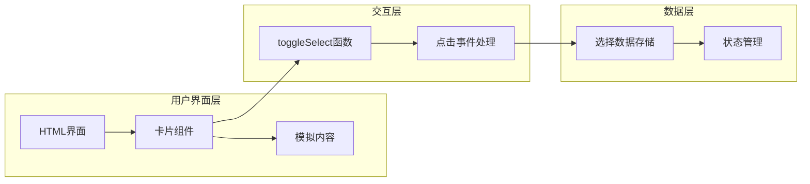
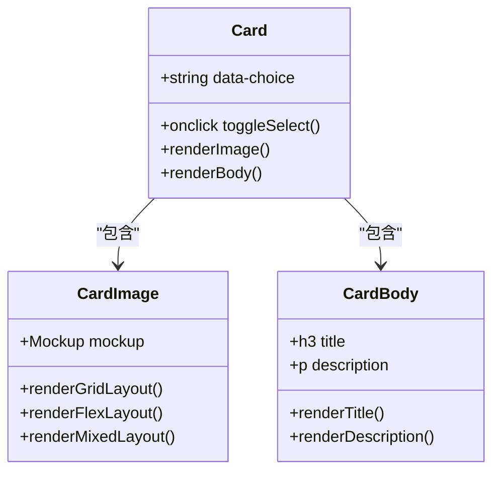
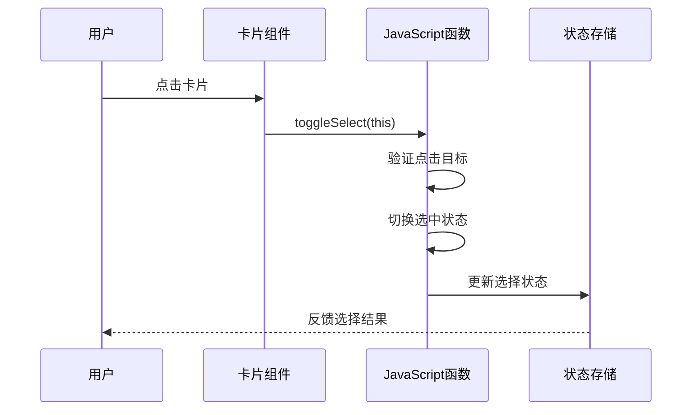
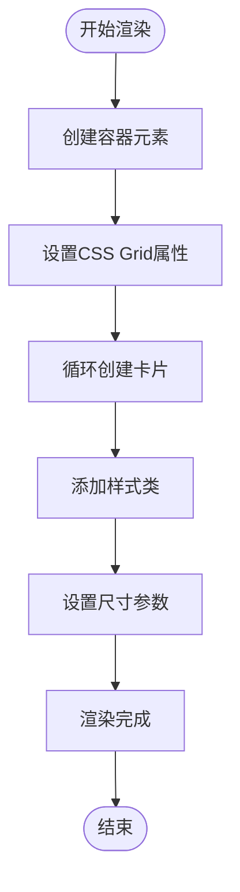
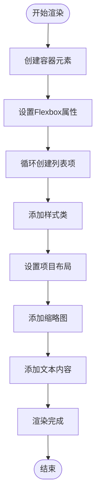
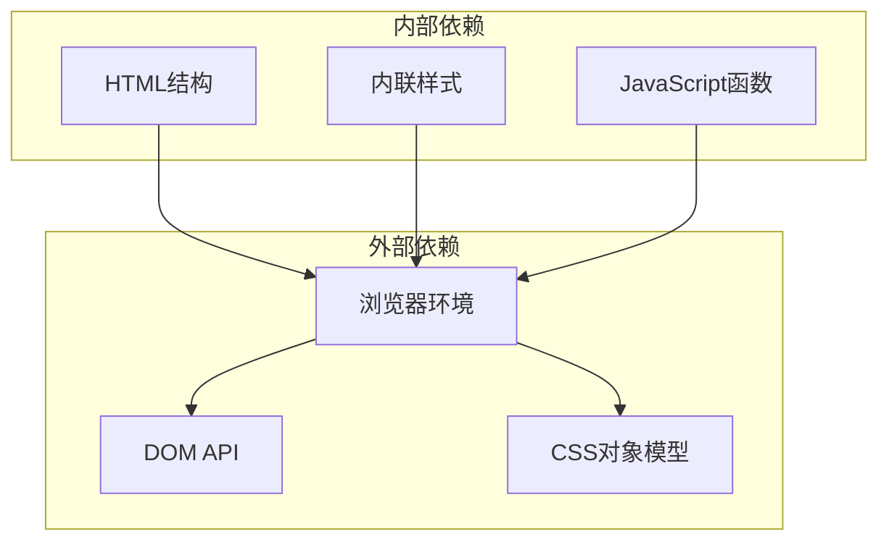
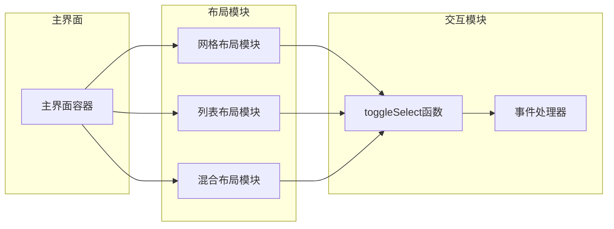

# 快速开始

<cite>
**本文档引用的文件**
- [layout-style.html](file://.superpowers/brainstorm/1153-1782210686/content/layout-style.html)
</cite>

## 目录
1. [简介](#简介)
2. [项目结构](#项目结构)
3. [核心组件](#核心组件)
4. [架构概览](#架构概览)
5. [详细组件分析](#详细组件分析)
6. [依赖关系分析](#依赖关系分析)
7. [性能考虑](#性能考虑)
8. [故障排除指南](#故障排除指南)
9. [结论](#结论)

## 简介

Next Demo Collection 是一个基于 Superpowers AI 平台构建的演示项目，专注于提供多种新闻布局风格的选择界面。该项目通过直观的可视化界面帮助用户在不同的布局选项之间进行选择，包括卡片网格、紧凑列表和头条+列表混合布局等设计模式。

该项目的核心价值在于：
- 提供三种主流新闻布局风格的可视化对比
- 支持用户通过点击选择最适合的布局方案
- 展示现代Web应用中布局设计的最佳实践
- 作为Superpowers AI平台集成的示范案例

## 项目结构

该项目采用极简的文件组织结构，主要包含一个HTML文件，该文件定义了完整的布局选择界面：

**图表来源**
- [layout-style.html:1-173](file://.superpowers/brainstorm/1153-1782210686/content/layout-style.html#L1-L173)

**章节来源**
- [.superpowers/brainstorm/1153-1782210686/content/layout-style.html:1-173](file://.superpowers/brainstorm/1153-1782210686/content/layout-style.html#L1-L173)

## 核心组件

### 布局选择界面组件

项目的核心是一个响应式的布局选择界面，包含三个主要的布局选项：

#### 组件一：卡片网格布局（选项A）
- **特点**：多列卡片布局，每条新闻一张卡片
- **信息密度**：高
- **适用场景**：需要快速浏览多个新闻摘要的场景
- **视觉元素**：网格系统、卡片边框、标题和摘要区域

#### 组件二：紧凑列表布局（选项B）
- **特点**：左侧缩略图 + 右侧标题摘要的列表布局
- **信息密度**：中等
- **适用场景**：类似资讯App的阅读体验
- **视觉元素**：Flexbox布局、图片占位符、简洁的文本排版

#### 组件三：混合布局（选项C）
- **特点**：头条大卡 + 下方小列表的组合布局
- **信息密度**：高
- **适用场景**：需要突出重点新闻同时保持整体信息量
- **视觉元素**：大卡片头部新闻、小卡片列表项

**章节来源**
- [.superpowers/brainstorm/1153-1782210686/content/layout-style.html:1-173](file://.superpowers/brainstorm/1153-1782210686/content/layout-style.html#L1-L173)

## 架构概览

该项目采用客户端渲染架构，所有逻辑都在浏览器端执行：

**图表来源**
- [layout-style.html:6-115](file://.superpowers/brainstorm/1153-1782210686/content/layout-style.html#L6-L115)

## 详细组件分析

### 卡片组件系统

每个布局选项都由一个卡片组件构成，包含以下核心部分：

#### 卡片结构

**图表来源**
- [layout-style.html:4-172](file://.superpowers/brainstorm/1153-1782210686/content/layout-style.html#L4-L172)

#### 交互流程

**图表来源**
- [layout-style.html:6-115](file://.superpowers/brainstorm/1153-1782210686/content/layout-style.html#L6-L115)

### 布局算法实现

#### 网格布局算法

**图表来源**
- [layout-style.html:10-48](file://.superpowers/brainstorm/1153-1782210686/content/layout-style.html#L10-L48)

#### 列表布局算法

**图表来源**
- [layout-style.html:62-107](file://.superpowers/brainstorm/1153-1782210686/content/layout-style.html#L62-L107)

## 依赖关系分析

### 外部依赖
该项目采用内联样式和JavaScript，不需要额外的外部依赖：

**图表来源**
- [layout-style.html:1-173](file://.superpowers/brainstorm/1153-1782210686/content/layout-style.html#L1-L173)

### 内部模块关系

**图表来源**
- [layout-style.html:4-172](file://.superpowers/brainstorm/1153-1782210686/content/layout-style.html#L4-L172)

## 性能考虑

### 渲染优化策略
- **内联样式**：减少HTTP请求，提高加载速度
- **CSS Grid**：利用现代浏览器的高效布局引擎
- **Flexbox**：提供灵活的弹性布局能力
- **最小化DOM操作**：通过事件委托减少重绘

### 内存管理
- **事件清理**：避免内存泄漏
- **样式缓存**：复用样式对象
- **组件复用**：统一的卡片组件设计

## 故障排除指南

### 常见问题及解决方案

#### 问题1：点击无响应
**症状**：点击卡片后没有选中效果  
**可能原因**：
- JavaScript函数未正确加载
- 事件绑定失败
- CSS样式冲突

**解决方法**：
1. 检查浏览器控制台是否有JavaScript错误
2. 验证toggleSelect函数是否可用
3. 确认CSS样式没有覆盖点击区域

#### 问题2：布局显示异常
**症状**：布局元素错位或样式不正确  
**可能原因**：
- 浏览器兼容性问题
- CSS Grid支持不足
- 响应式断点问题

**解决方法**：
1. 检查浏览器对CSS Grid的支持情况
2. 添加适当的回退样式
3. 调整媒体查询断点

#### 问题3：移动端适配问题
**症状**：在移动设备上显示效果不佳  
**可能原因**：
- 缺少视口配置
- 字体大小不合适
- 点击目标过小

**解决方法**：
1. 添加meta viewport标签
2. 使用相对单位（rem/em）
3. 增加触摸目标的最小尺寸

## 结论

Next Demo Collection项目展示了如何使用Superpowers AI平台快速构建现代化的布局选择界面。该项目虽然结构简单，但体现了以下关键设计原则：

1. **用户体验优先**：直观的视觉对比帮助用户快速做出决策
2. **响应式设计**：适应不同屏幕尺寸和设备类型
3. **可扩展性**：模块化的组件设计便于功能扩展
4. **性能优化**：内联资源和高效的CSS布局

对于初学者而言，这个项目提供了学习现代Web开发技术的良好起点，包括：
- HTML语义化标记
- CSS Grid和Flexbox布局
- JavaScript事件处理
- 响应式设计原理
- 用户体验设计原则

建议开发者在此基础上进一步扩展功能，如添加更多的布局选项、实现动态内容加载、集成用户偏好存储等。