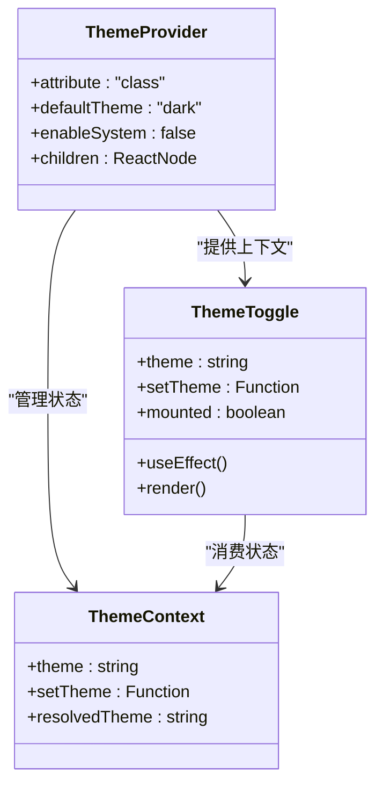
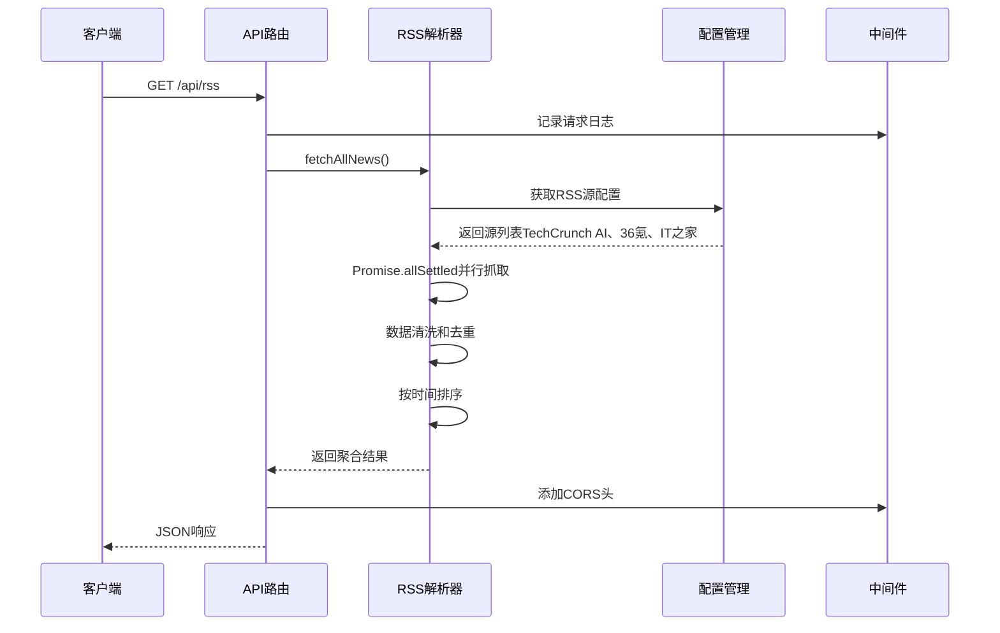
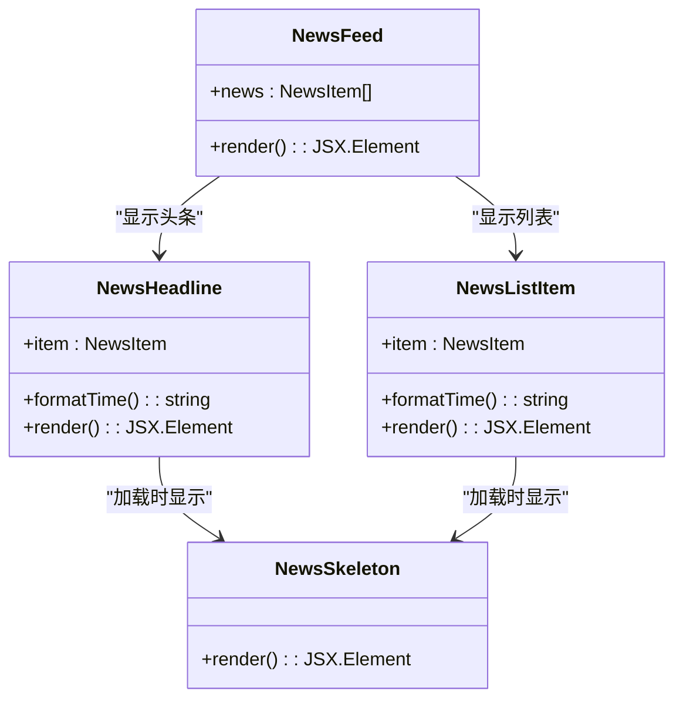
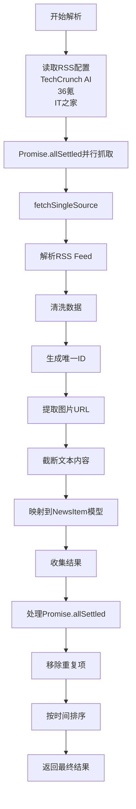
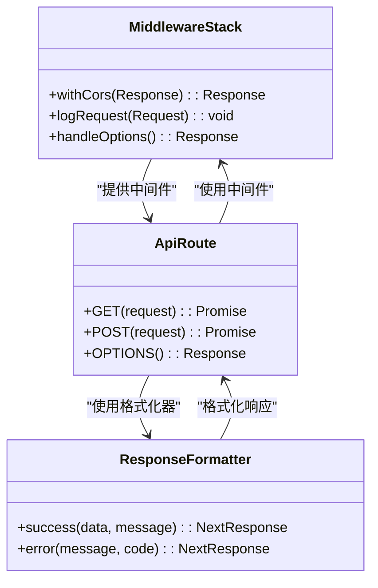

# 技术实现细节

<cite>
**本文档引用的文件**
- [package.json](file://package.json)
- [app/layout.tsx](file://app/layout.tsx)
- [app/page.tsx](file://app/page.tsx)
- [app/api/rss/route.ts](file://app/api/rss/route.ts)
- [app/api/_shared/middleware.ts](file://app/api/_shared/middleware.ts)
- [app/api/_shared/response.ts](file://app/api/_shared/response.ts)
- [lib/rss.ts](file://lib/rss.ts)
- [lib/rss-config.ts](file://lib/rss-config.ts)
- [lib/types.ts](file://lib/types.ts)
- [components/ThemeProvider.tsx](file://components/ThemeProvider.tsx)
- [components/ThemeToggle.tsx](file://components/ThemeToggle.tsx)
- [components/TabBar.tsx](file://components/TabBar.tsx)
- [components/ai-news/NewsFeed.tsx](file://components/ai-news/NewsFeed.tsx)
- [components/ai-news/NewsHeadline.tsx](file://components/ai-news/NewsHeadline.tsx)
- [components/ai-news/NewsListItem.tsx](file://components/ai-news/NewsListItem.tsx)
- [components/ai-news/NewsSkeleton.tsx](file://components/ai-news/NewsSkeleton.tsx)
</cite>

## 更新摘要
**变更内容**
- 新增完整的RSS新闻聚合系统，支持TechCrunch AI、36氪和IT之家三个RSS源的并行抓取和智能聚合
- 实现统一的API中间件和响应格式化系统，提供CORS处理、请求日志和标准化响应
- 建立TypeScript类型系统，定义NewsItem、RssSource和TabConfig等核心接口
- 开发AI新闻组件库，包含头条卡片、列表条目和骨架屏组件
- 集成主题系统和响应式设计，支持深色/浅色模式切换

## 目录
1. [项目概述](#项目概述)
2. [项目结构](#项目结构)
3. [核心组件分析](#核心组件分析)
4. [架构概览](#架构概览)
5. [详细组件分析](#详细组件分析)
6. [依赖关系分析](#依赖关系分析)
7. [性能考虑](#性能考虑)
8. [故障排除指南](#故障排除指南)
9. [结论](#结论)

## 项目概述

Next Demo Collection 是一个现代化的Next.js演示集合平台，专注于AI相关新闻的RSS聚合展示。项目采用TypeScript和Tailwind CSS构建，集成了智能主题切换、组件化架构和API共享层等现代Web开发技术栈。

**更新** 项目已从简单的HTML布局演示升级为完整的Next.js应用，具备RSS聚合、主题系统、组件化架构等企业级功能。新增的AI新闻RSS聚合系统支持多源新闻数据聚合，提供智能化的内容展示和交互体验。RSS源配置现已更新为包含TechCrunch AI、36氪和IT之家三个权威新闻源。

## 项目结构

项目采用标准的Next.js App Router架构，包含API路由、组件库、业务逻辑层和共享服务层：

```mermaid
graph TB
subgraph "应用层"
APP_LAYOUT[app/layout.tsx<br/>根布局]
APP_PAGE[app/page.tsx<br/>主页]
API_RSS[app/api/rss/route.ts<br/>RSS API路由]
END
subgraph "组件层"
THEME_PROVIDER[components/ThemeProvider.tsx<br/>主题提供者]
THEME_TOGGLE[components/ThemeToggle.tsx<br/>主题切换器]
TAB_BAR[components/TabBar.tsx<br/>标签栏组件]
AI_NEWS[components/ai-news/<br/>AI新闻组件库]
END
subgraph "业务逻辑层"
RSS_LIB[lib/rss.ts<br/>RSS解析器]
RSS_CONFIG[lib/rss-config.ts<br/>RSS配置]
TYPES[lib/types.ts<br/>类型定义]
END
subgraph "共享服务层"
MIDDLEWARE[app/api/_shared/middleware.ts<br/>中间件]
RESPONSE[app/api/_shared/response.ts<br/>响应格式]
END
APP_LAYOUT --> THEME_PROVIDER
THEME_PROVIDER --> THEME_TOGGLE
THEME_PROVIDER --> TAB_BAR
THEME_PROVIDER --> AI_NEWS
API_RSS --> MIDDLEWARE
API_RSS --> RESPONSE
API_RSS --> RSS_LIB
RSS_LIB --> RSS_CONFIG
RSS_LIB --> TYPES
AI_NEWS --> TYPES
```

**图表来源**
- [app/layout.tsx:1-44](file://app/layout.tsx#L1-L44)
- [components/ThemeProvider.tsx:1-18](file://components/ThemeProvider.tsx#L1-L18)
- [lib/rss.ts:1-87](file://lib/rss.ts#L1-L87)

**章节来源**
- [app/layout.tsx:1-44](file://app/layout.tsx#L1-L44)
- [package.json:1-29](file://package.json#L1-L29)

## 核心组件分析

### 主题系统架构

项目集成next-themes库实现智能主题切换，支持深色/浅色模式自动切换：



**图表来源**
- [components/ThemeProvider.tsx:1-18](file://components/ThemeProvider.tsx#L1-L18)
- [components/ThemeToggle.tsx:1-43](file://components/ThemeToggle.tsx#L1-L43)

### AI新闻RSS聚合系统

AI新闻RSS聚合系统通过多源并行抓取实现高效的内容聚合，支持智能去重和时间排序：



**图表来源**
- [app/api/rss/route.ts:1-28](file://app/api/rss/route.ts#L1-L28)
- [lib/rss.ts:62-87](file://lib/rss.ts#L62-L87)

**章节来源**
- [components/ThemeProvider.tsx:1-18](file://components/ThemeProvider.tsx#L1-L18)
- [components/ThemeToggle.tsx:1-43](file://components/ThemeToggle.tsx#L1-L43)
- [lib/rss.ts:1-87](file://lib/rss.ts#L1-L87)

## 架构概览

项目采用分层架构设计，清晰分离关注点：

```mermaid
graph TD
subgraph "表现层"
LAYOUT[根布局]
PAGE[主页组件]
THEME_UI[主题UI组件]
TAB_UI[标签栏组件]
AI_NEWS_UI[AI新闻UI组件]
END
subgraph "业务逻辑层"
RSS_SERVICE[RSS服务层]
NEWS_PROCESSOR[新闻处理器]
DATA_CLEANER[数据清理器]
TIME_SORTER[时间排序器]
DUPLICATE_REMOVER[去重处理器]
END
subgraph "基础设施层"
API_GATEWAY[API网关]
MIDDLEWARE_STACK[中间件栈]
RESPONSE_FORMATTER[响应格式化]
CORS_HANDLER[CORS处理]
LOGGING_SYSTEM[日志系统]
END
subgraph "数据层"
RSS_SOURCES[RSS源配置<br/>TechCrunch AI<br/>36氪<br/>IT之家]
CACHE_LAYER[缓存层]
DATABASE[数据库]
END
LAYOUT --> THEME_UI
PAGE --> TAB_UI
THEME_UI --> API_GATEWAY
TAB_UI --> API_GATEWAY
AI_NEWS_UI --> API_GATEWAY
API_GATEWAY --> RSS_SERVICE
RSS_SERVICE --> NEWS_PROCESSOR
NEWS_PROCESSOR --> DATA_CLEANER
DATA_CLEANER --> DUPLICATE_REMOVER
DUPLICATE_REMOVER --> TIME_SORTER
TIME_SORTER --> CACHE_LAYER
CACHE_LAYER --> DATABASE
```

**图表来源**
- [app/layout.tsx:29-43](file://app/layout.tsx#L29-L43)
- [lib/rss.ts:18-61](file://lib/rss.ts#L18-L61)

## 详细组件分析

### AI新闻组件架构

AI新闻组件采用分层设计，包含头条新闻和列表新闻两种展示形式：



**图表来源**
- [components/ai-news/NewsFeed.tsx:1-43](file://components/ai-news/NewsFeed.tsx#L1-L43)
- [components/ai-news/NewsHeadline.tsx:1-63](file://components/ai-news/NewsHeadline.tsx#L1-L63)
- [components/ai-news/NewsListItem.tsx:1-56](file://components/ai-news/NewsListItem.tsx#L1-L56)

### RSS解析器实现

RSS解析器采用异步并发处理策略，支持多源并行抓取和智能去重：



**图表来源**
- [lib/rss.ts:18-87](file://lib/rss.ts#L18-L87)

### API共享层设计

API共享层提供统一的中间件和响应格式，确保API的一致性和可维护性：



**图表来源**
- [app/api/_shared/middleware.ts:1-32](file://app/api/_shared/middleware.ts#L1-L32)
- [app/api/_shared/response.ts:1-34](file://app/api/_shared/response.ts#L1-L34)

### 组件架构设计

组件采用函数式组件和React Hooks模式，实现状态管理和生命周期控制：

```mermaid
graph LR
subgraph "组件层次"
THEME_PROVIDER[ThemeProvider]
THEME_TOGGLE[ThemeToggle]
TAB_BAR[TabBar]
NEWS_FEED[NewsFeed]
NEWS_HEADLINE[NewsHeadline]
NEWS_LIST_ITEM[NewsListItem]
NEWS_SKELETON[NewsSkeleton]
END
subgraph "状态管理"
USE_THEME[useTheme Hook]
USE_STATE[useState Hook]
USE_EFFECT[useEffect Hook]
END
THEME_PROVIDER --> THEME_TOGGLE
THEME_PROVIDER --> TAB_BAR
THEME_PROVIDER --> NEWS_FEED
THEME_TOGGLE --> USE_THEME
THEME_TOGGLE --> USE_STATE
THEME_TOGGLE --> USE_EFFECT
TAB_BAR --> USE_STATE
TAB_BAR --> USE_EFFECT
NEWS_FEED --> USE_STATE
NEWS_FEED --> USE_EFFECT
```

**图表来源**
- [components/ThemeProvider.tsx:10-17](file://components/ThemeProvider.tsx#L10-L17)
- [components/ThemeToggle.tsx:1-43](file://components/ThemeToggle.tsx#L1-L43)

**章节来源**
- [lib/rss.ts:1-87](file://lib/rss.ts#L1-L87)
- [app/api/_shared/middleware.ts:1-32](file://app/api/_shared/middleware.ts#L1-L32)
- [components/TabBar.tsx:1-37](file://components/TabBar.tsx#L1-L37)

## 依赖关系分析

项目依赖采用模块化设计，支持按需加载和Tree Shaking优化：

```mermaid
graph TB
subgraph "核心依赖"
NEXTJS[Next.js 16.2.9]
REACT[React 19.2.4]
TYPESCRIPT[TypeScript 5]
TAILWIND[Tailwind CSS 4]
NEXT_THEMES[next-themes 0.4.6]
END
subgraph "RSS处理"
RSS_PARSER[rss-parser 3.13.0]
CRYPTO_NODE[Node.js Crypto]
END
subgraph "开发工具"
ESLINT[ESLint 9]
TYPINGS[TypeScript Types]
POSTCSS[PostCSS]
END
NEXTJS --> REACT
NEXTJS --> NEXT_THEMES
NEXTJS --> RSS_PARSER
NEXTJS --> TAILWIND
NEXTJS --> TYPESCRIPT
NEXT_THEMES --> REACT
RSS_PARSER --> CRYPTO_NODE
```

**图表来源**
- [package.json:11-27](file://package.json#L11-L27)

**章节来源**
- [package.json:1-29](file://package.json#L1-29)

## 性能考虑

### RSS聚合性能优化

1. **并发抓取策略**：使用Promise.allSettled实现多源并行抓取，提升整体响应速度
2. **智能去重机制**：基于MD5哈希的唯一ID生成，确保数据去重效率
3. **内存优化**：流式处理RSS数据，避免大文件内存占用
4. **缓存策略**：启用ISR（增量静态再生）每24小时重新验证一次

### API性能优化

1. **中间件缓存**：统一的CORS处理和请求日志记录，减少重复计算
2. **响应格式化**：标准化的JSON响应格式，降低客户端解析开销
3. **错误处理**：优雅的错误处理机制，避免服务崩溃影响用户体验
4. **CORS优化**：预检请求处理，支持跨域资源共享

### 组件性能优化

1. **React.memo优化**：对纯展示组件使用memo化避免不必要的重渲染
2. **懒加载实现**：按需加载大型组件，提升首屏加载速度
3. **状态分离**：将全局状态和局部状态分离，优化更新范围
4. **骨架屏优化**：使用动画骨架屏提升用户感知性能

### 主题系统性能

1. **客户端渲染**：主题切换在客户端完成，避免服务器端渲染开销
2. **CSS变量优化**：使用CSS自定义属性实现主题切换，性能优异
3. **预渲染支持**：支持静态生成和服务器端渲染，SEO友好

## 故障排除指南

### RSS聚合问题

1. **RSS源访问失败**
   - 现象：部分RSS源无法获取数据
   - 解决方案：检查网络连接和代理设置，验证RSS源URL有效性
   - 预防措施：实现重试机制和超时处理，添加错误日志记录

2. **数据解析错误**
   - 现象：RSS数据格式不规范导致解析失败
   - 解决方案：添加数据验证和默认值处理，使用try-catch捕获异常
   - 预防措施：实现数据清洗和格式标准化，提供降级方案

### API接口问题

1. **CORS跨域问题**
   - 现象：浏览器阻止跨域请求
   - 解决方案：检查CORS头部设置，验证允许的源和方法
   - 预防措施：使用统一的中间件处理，配置正确的CORS策略

2. **响应格式异常**
   - 现象：客户端接收非预期的响应格式
   - 解决方案：验证响应格式化器，检查API版本兼容性
   - 预防措施：添加响应格式验证，实现API文档同步

### 组件渲染问题

1. **主题切换失效**
   - 现象：主题切换按钮无响应
   - 解决方案：检查useTheme hook状态，验证hydrate兼容性
   - 预防措施：实现hydration兼容性处理，添加状态初始化

2. **标签栏状态同步**
   - 现象：标签切换状态不一致
   - 解决方案：验证props传递和状态管理，检查事件处理函数
   - 预防措施：使用受控组件模式，实现状态一致性保证

3. **新闻图片加载失败**
   - 现象：新闻图片无法显示或加载缓慢
   - 解决方案：实现图片错误处理和降级方案，优化图片资源
   - 预防措施：添加图片懒加载，实现占位符显示

**章节来源**
- [lib/rss.ts:39-56](file://lib/rss.ts#L39-L56)
- [app/api/_shared/middleware.ts:15-19](file://app/api/_shared/middleware.ts#L15-L19)
- [components/ThemeToggle.tsx:10-16](file://components/ThemeToggle.tsx#L10-L16)

## 结论

Next Demo Collection 项目展示了现代Next.js应用的完整技术栈实现。通过AI新闻RSS聚合系统、API共享层、组件架构和主题系统的有机结合，项目实现了功能丰富、性能优异的企业级应用。

### 主要技术成就

1. **AI新闻RSS聚合系统**：实现了高效的多源并行抓取和智能数据处理，支持TechCrunch AI、36氪和IT之家等RSS源
2. **API共享层**：建立了统一的中间件和响应格式标准，提供CORS处理和日志记录功能
3. **组件化架构**：采用函数式组件和Hooks模式，实现清晰的状态管理和组件复用
4. **主题系统**：集成了智能主题切换，支持深色/浅色模式和系统偏好检测
5. **TypeScript支持**：完整的类型定义，提升开发体验和代码质量
6. **响应式设计**：实现移动端优先的设计理念，支持多种设备适配

### 架构优势

1. **分层清晰**：表现层、业务逻辑层、基础设施层职责明确，便于维护和扩展
2. **可扩展性**：模块化设计支持功能扩展和维护，新增RSS源和组件无需重构
3. **性能优化**：并发处理、缓存策略、懒加载等多重优化，确保应用性能
4. **开发体验**：TypeScript、ESLint、Tailwind CSS等工具链完善，提升开发效率
5. **用户体验**：智能去重、时间排序、骨架屏等特性优化用户感知性能

### 未来发展方向

1. **缓存策略**：实现Redis缓存和CDN加速，进一步提升数据访问性能
2. **监控系统**：添加APM监控和错误追踪，完善应用可观测性
3. **测试覆盖**：完善单元测试和集成测试，确保代码质量稳定性
4. **部署优化**：CI/CD流水线和容器化部署，提升发布效率和可靠性
5. **功能扩展**：支持更多RSS源、搜索功能、用户个性化推荐等高级特性

该项目为学习现代前端开发技术和架构设计提供了优秀的实践案例，展示了如何在保持代码质量的同时实现复杂的功能需求，为后续的功能扩展和技术演进奠定了坚实基础。