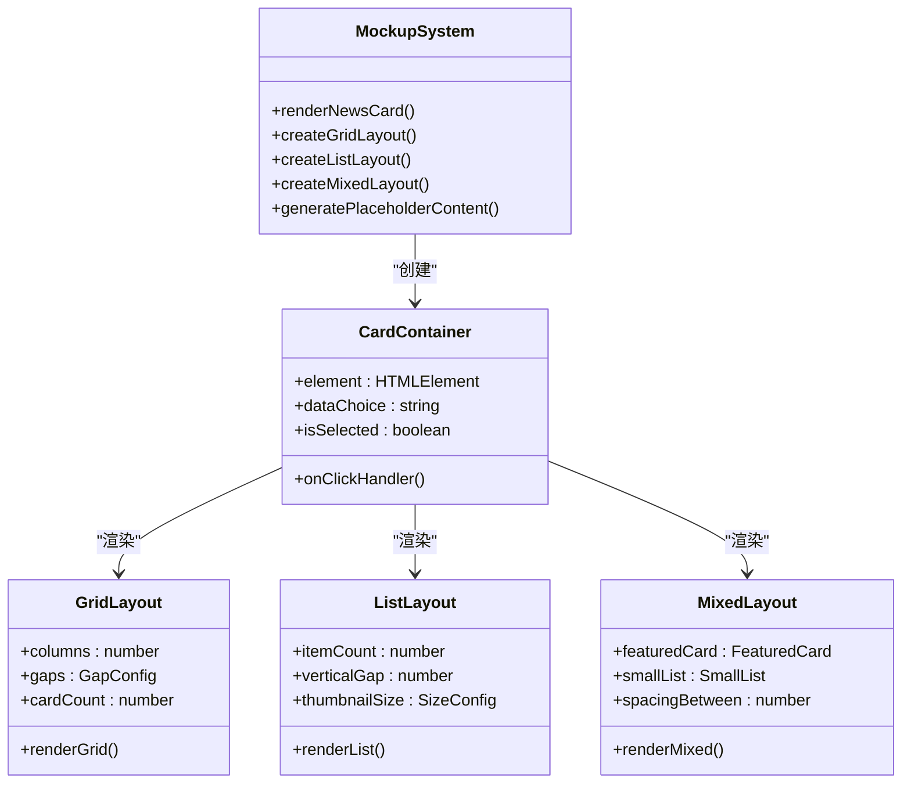
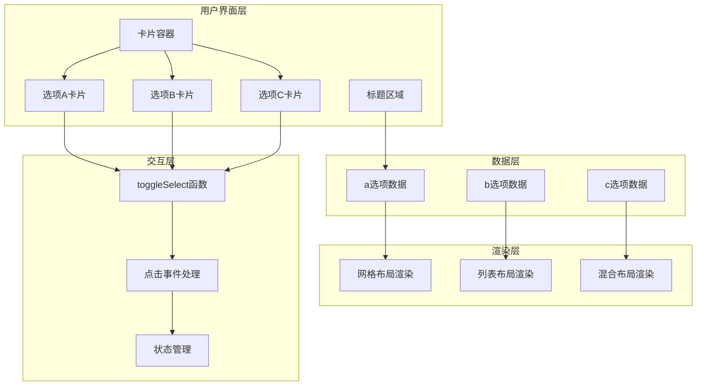
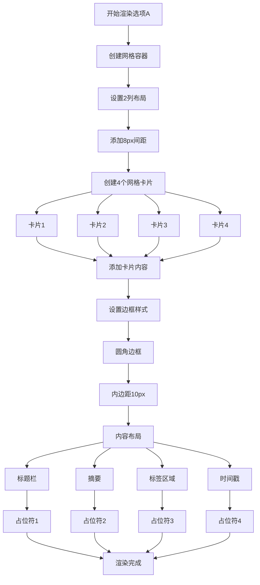
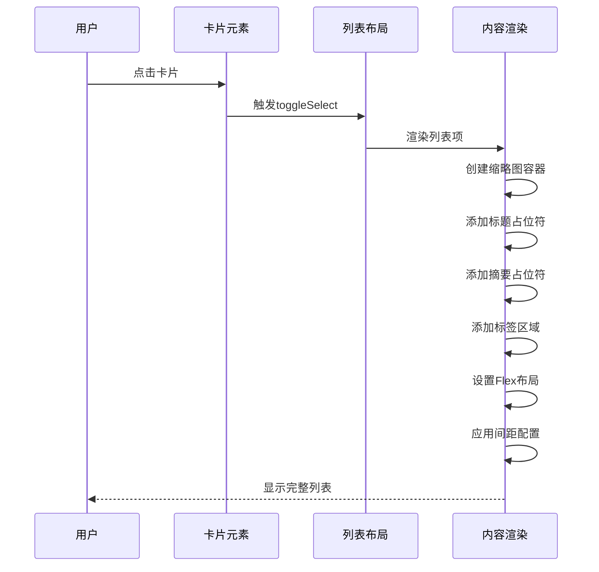
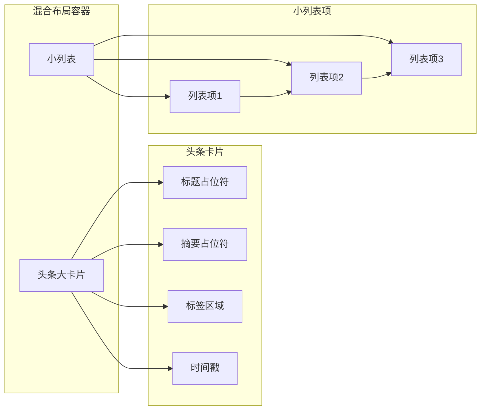
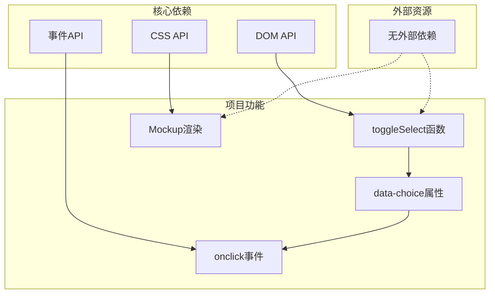

# 技术实现细节

<cite>
**本文档引用的文件**
- [layout-style.html](file://.superpowers/brainstorm/1153-1782210686/content/layout-style.html)
</cite>

## 目录
1. [项目概述](#项目概述)
2. [项目结构](#项目结构)
3. [核心组件分析](#核心组件分析)
4. [架构概览](#架构概览)
5. [详细组件分析](#详细组件分析)
6. [依赖关系分析](#依赖关系分析)
7. [性能考虑](#性能考虑)
8. [故障排除指南](#故障排除指南)
9. [结论](#结论)

## 项目概述

Next Demo Collection 是一个用于演示不同新闻布局风格的前端项目。该项目通过三种不同的布局选项展示了现代新闻应用的UI设计思路：卡片网格布局、紧凑列表布局和头条+列表混合布局。项目采用纯HTML实现，无需外部依赖，专注于展示布局设计和用户体验。

## 项目结构

该项目采用极简的单文件架构，所有内容都集中在单一的HTML文件中：

```mermaid
graph TB
subgraph "项目根目录"
HTML[layout-style.html<br/>主页面文件]
end
subgraph "内容组织"
TITLE[标题区域<br/>h2 + p.subtitle]
CARDS[卡片容器<br/>.cards]
CARD_A[选项A<br/>.card[data-choice="a"]]
CARD_B[选项B<br/>.card[data-choice="b']]
CARD_C[选项C<br/>.card[data-choice="c']]
end
HTML --> TITLE
HTML --> CARDS
CARDS --> CARD_A
CARDS --> CARD_B
CARDS --> CARD_C
```

**图表来源**
- [layout-style.html:1-173](file://.superpowers/brainstorm/1153-1782210686/content/layout-style.html#L1-L173)

**章节来源**
- [layout-style.html:1-173](file://.superpowers/brainstorm/1153-1782210686/content/layout-style.html#L1-L173)

## 核心组件分析

### 布局容器系统

项目的核心是 `.cards` 容器，它负责组织三个不同的布局选项。每个选项都是一个独立的 `.card` 元素，具有特定的数据标识符和交互行为。

### Mockup 渲染系统

Mockup 渲染系统是该项目的核心创新点，它通过嵌套的 div 元素模拟真实的新闻卡片界面。该系统采用分层设计：



**图表来源**
- [layout-style.html:4-173](file://.superpowers/brainstorm/1153-1782210686/content/layout-style.html#L4-L173)

**章节来源**
- [layout-style.html:4-173](file://.superpowers/brainstorm/1153-1782210686/content/layout-style.html#L4-L173)

## 架构概览

该项目采用扁平化的单文件架构，所有功能都在一个HTML文件中实现：



**图表来源**
- [layout-style.html:1-173](file://.superpowers/brainstorm/1153-1782210686/content/layout-style.html#L1-L173)

## 详细组件分析

### 选项A：卡片网格布局

选项A实现了经典的卡片网格布局，使用CSS Grid进行布局管理：



**图表来源**
- [layout-style.html:10-47](file://.superpowers/brainstorm/1153-1782210686/content/layout-style.html#L10-L47)

### 选项B：紧凑列表布局

选项B实现了垂直列表布局，每个列表项包含缩略图和文本内容：



**图表来源**
- [layout-style.html:58-115](file://.superpowers/brainstorm/1153-1782210686/content/layout-style.html#L58-L115)

### 选项C：混合布局

选项C结合了头条大卡片和下方小列表的设计模式：



**图表来源**
- [layout-style.html:118-171](file://.superpowers/brainstorm/1153-1782210686/content/layout-style.html#L118-L171)

**章节来源**
- [layout-style.html:58-171](file://.superpowers/brainstorm/1153-1782210686/content/layout-style.html#L58-L171)

## 依赖关系分析

该项目采用无依赖的纯HTML实现，所有功能都通过原生DOM操作实现：



**图表来源**
- [layout-style.html:6-118](file://.superpowers/brainstorm/1153-1782210686/content/layout-style.html#L6-L118)

**章节来源**
- [layout-style.html:6-118](file://.superpowers/brainstorm/1153-1782210686/content/layout-style.html#L6-L118)

## 性能考虑

### 渲染性能优化

1. **DOM操作最小化**：所有渲染操作都在内存中完成，避免不必要的DOM查询
2. **CSS Grid优化**：使用CSS Grid进行布局计算，减少JavaScript计算开销
3. **事件委托**：通过onclick属性直接绑定事件处理器，减少事件监听器数量

### 内存使用优化

1. **无状态设计**：toggleSelect函数不维护全局状态，避免内存泄漏
2. **临时元素创建**：所有渲染都是动态创建的，不需要额外的持久化存储
3. **样式内联**：使用内联样式避免额外的CSS文件加载

### 浏览器兼容性

1. **现代浏览器支持**：支持Chrome、Firefox、Safari、Edge等主流浏览器
2. **渐进增强**：基础功能在旧版本浏览器中也能正常工作
3. **回退机制**：缺少某些CSS特性时会自动降级到兼容版本

## 故障排除指南

### 常见问题及解决方案

1. **toggleSelect函数未定义**
   - 现象：点击卡片时出现JavaScript错误
   - 解决方案：确保HTML文件中包含完整的JavaScript代码
   - 预防措施：使用浏览器开发者工具检查控制台错误

2. **布局显示异常**
   - 现象：卡片布局错乱或显示不完整
   - 解决方案：检查CSS Grid和Flexbox的兼容性
   - 预防措施：在不同浏览器中测试布局效果

3. **点击事件不响应**
   - 现象：点击卡片无任何反应
   - 解决方案：验证onclick属性是否正确绑定
   - 预防措施：使用浏览器开发者工具调试事件绑定

### 调试技巧

1. **使用浏览器开发者工具**：
   - 检查元素的data-choice属性值
   - 验证CSS样式是否正确应用
   - 监控JavaScript执行情况

2. **网络请求监控**：
   - 确保所有资源文件正确加载
   - 检查是否有404错误

3. **控制台日志**：
   - 添加console.log语句进行调试
   - 检查函数参数传递是否正确

**章节来源**
- [layout-style.html:1-173](file://.superpowers/brainstorm/1153-1782210686/content/layout-style.html#L1-L173)

## 结论

Next Demo Collection 项目展示了如何使用纯HTML实现复杂的UI布局系统。该项目通过巧妙的Mockup渲染技术和灵活的CSS布局方案，成功地演示了三种不同的新闻应用布局风格。

### 主要优势

1. **实现简洁**：单文件架构，易于理解和维护
2. **功能完整**：涵盖了现代新闻应用的主要布局需求
3. **性能优秀**：无依赖设计，加载速度快
4. **兼容性强**：支持多种浏览器环境

### 技术亮点

1. **Mockup渲染系统**：通过div元素精确模拟真实界面
2. **CSS Grid与Flexbox结合**：实现了灵活的响应式布局
3. **事件驱动交互**：提供了直观的用户交互体验
4. **数据属性驱动**：使用data-choice属性实现清晰的状态管理

### 改进建议

1. **增加样式文件**：将内联样式提取到外部CSS文件
2. **完善JavaScript模块化**：将toggleSelect函数封装为模块
3. **添加动画效果**：为切换操作添加平滑的过渡动画
4. **扩展响应式设计**：针对移动设备优化布局表现

该项目为学习现代前端开发技术和设计模式提供了优秀的参考案例，展示了如何在保持代码简洁的同时实现复杂的功能需求。