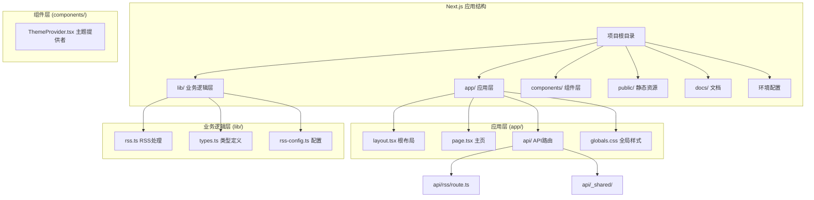
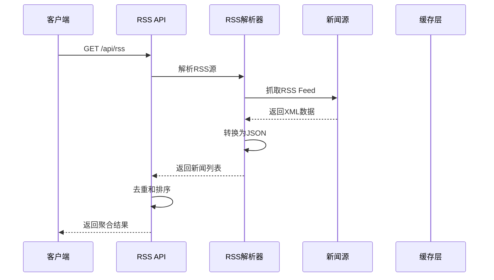
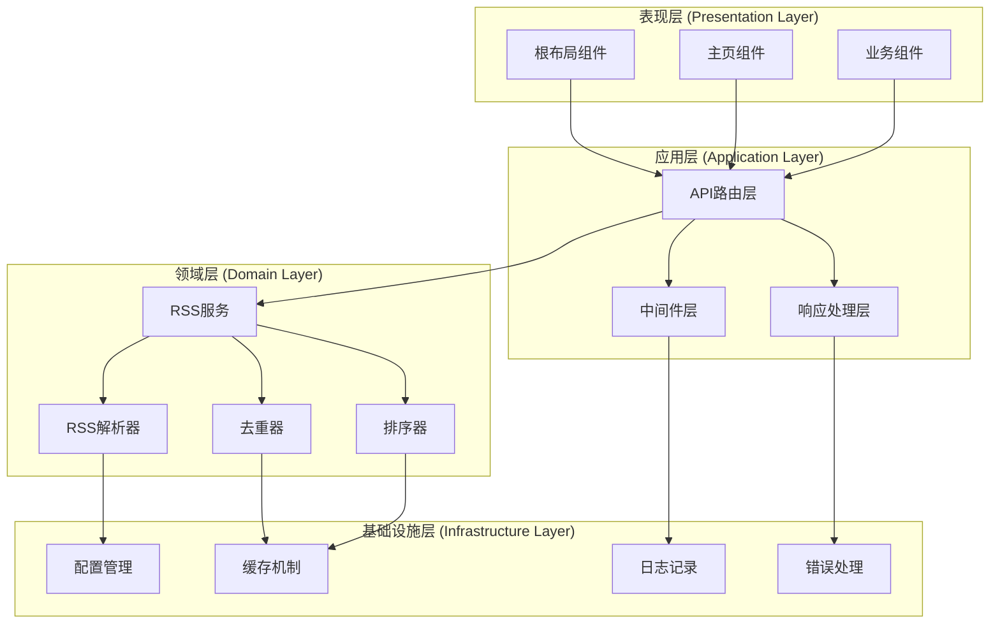
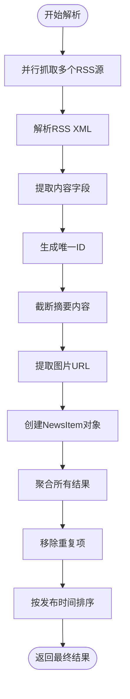
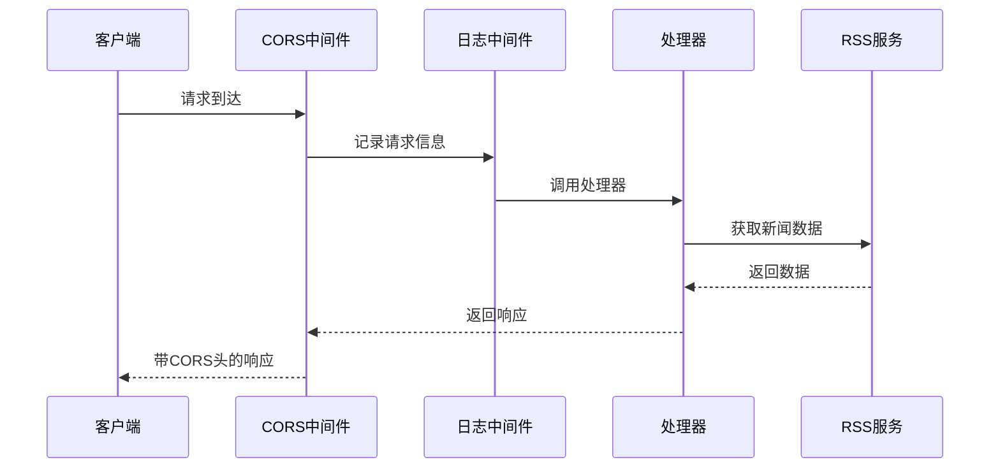
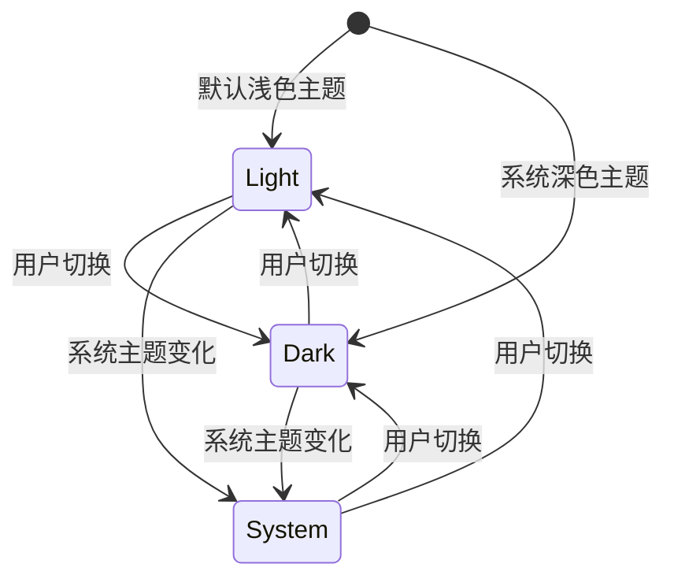
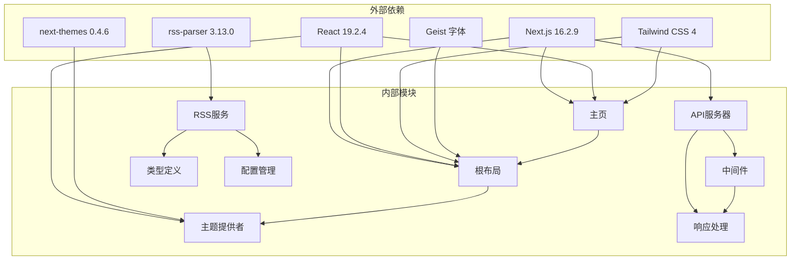

# 项目概述

<cite>
**本文档中引用的文件**
- [package.json](file://package.json)
- [app/layout.tsx](file://app/layout.tsx)
- [app/page.tsx](file://app/page.tsx)
- [lib/rss.ts](file://lib/rss.ts)
- [lib/types.ts](file://lib/types.ts)
- [lib/rss-config.ts](file://lib/rss-config.ts)
- [app/api/rss/route.ts](file://app/api/rss/route.ts)
- [app/api/_shared/middleware.ts](file://app/api/_shared/middleware.ts)
- [app/api/_shared/response.ts](file://app/api/_shared/response.ts)
- [components/ThemeProvider.tsx](file://components/ThemeProvider.tsx)
- [app/globals.css](file://app/globals.css)
- [next.config.ts](file://next.config.ts)
- [README.md](file://README.md)
</cite>

## 目录
1. [简介](#简介)
2. [项目结构](#项目结构)
3. [核心组件](#核心组件)
4. [架构概览](#架构概览)
5. [详细组件分析](#详细组件分析)
6. [依赖关系分析](#依赖关系分析)
7. [性能考虑](#性能考虑)
8. [故障排除指南](#故障排除指南)
9. [结论](#结论)

## 简介

Next Demo Collection项目是一个基于Next.js 16.2.9构建的现代化演示集合平台，已从最初的Superpowers布局选择器发展为一个功能完整的新闻聚合和展示系统。该项目集成了RSS新闻聚合、RESTful API架构、主题系统和响应式设计，为开发者提供了一个全面的演示平台。

项目的核心目标是展示现代Web开发技术的最佳实践，包括：
- **RSS新闻聚合**：自动抓取和整合多个新闻源的内容
- **RESTful API架构**：提供标准化的数据访问接口
- **主题系统**：支持明暗主题切换的现代化UI设计
- **响应式布局**：适配各种设备和屏幕尺寸
- **TypeScript集成**：提供类型安全的开发体验

该平台不仅展示了技术实现，还为开发者提供了一个可扩展的原型框架，可以轻松添加新的演示功能和内容源。

## 项目结构

项目采用现代化的Next.js App Router架构，具有清晰的分层结构：

**图表来源**
- [package.json:1-29](file://package.json#L1-L29)
- [app/layout.tsx:1-36](file://app/layout.tsx#L1-L36)
- [lib/rss.ts:1-71](file://lib/rss.ts#L1-L71)

**章节来源**
- [package.json:1-29](file://package.json#L1-L29)
- [app/layout.tsx:1-36](file://app/layout.tsx#L1-L36)
- [lib/rss.ts:1-71](file://lib/rss.ts#L1-L71)

## 核心组件

### RSS新闻聚合系统

项目的核心功能是集成多个RSS新闻源，提供统一的新闻聚合服务：

#### 主要特性：
- **多源聚合**：支持TechCrunch AI和机器之心等新闻源
- **自动去重**：基于MD5哈希算法去除重复内容
- **内容提取**：自动提取标题、摘要、图片和发布时间
- **错误处理**：完善的异常捕获和降级机制

#### 数据流程：

**图表来源**
- [lib/rss.ts:27-71](file://lib/rss.ts#L27-L71)
- [app/api/rss/route.ts:6-17](file://app/api/rss/route.ts#L6-L17)

### RESTful API架构

项目实现了标准化的API设计模式，提供HTTP状态码和统一响应格式：

#### API规范：
- **HTTP方法**：GET用于数据获取，OPTIONS用于CORS预检
- **响应格式**：统一的JSON响应结构，包含code、message和data字段
- **CORS支持**：完整的跨域资源共享配置
- **错误处理**：标准化的错误响应和状态码

**章节来源**
- [app/api/rss/route.ts:1-22](file://app/api/rss/route.ts#L1-L22)
- [app/api/_shared/response.ts:1-27](file://app/api/_shared/response.ts#L1-L27)
- [app/api/_shared/middleware.ts:1-25](file://app/api/_shared/middleware.ts#L1-L25)

### 主题系统

集成next-themes库实现智能的主题切换功能：

#### 功能特性：
- **明暗主题**：支持浅色和深色两种主题模式
- **系统感知**：自动检测系统主题偏好
- **客户端状态**：使用use client指令管理主题状态
- **CSS变量**：通过CSS自定义属性实现主题切换

**章节来源**
- [components/ThemeProvider.tsx:1-13](file://components/ThemeProvider.tsx#L1-L13)
- [app/layout.tsx:4-4](file://app/layout.tsx#L4-L4)

## 架构概览

项目采用了分层架构设计，确保关注点分离和代码的可维护性：

**图表来源**
- [lib/rss.ts:1-71](file://lib/rss.ts#L1-L71)
- [app/api/rss/route.ts:1-22](file://app/api/rss/route.ts#L1-L22)

### 技术栈

项目采用现代全栈技术栈，确保最佳的开发体验和性能：

- **前端框架**：Next.js 16.2.9，支持App Router和Server Components
- **UI库**：Tailwind CSS 4，提供原子化CSS类名
- **字体系统**：Geist字体，优化的Web字体加载
- **主题系统**：next-themes 0.4.6，支持明暗主题切换
- **RSS处理**：rss-parser 3.13.0，高效的RSS解析库
- **类型系统**：TypeScript 5，提供完整的类型安全保障
- **构建工具**：ESLint 9，代码质量保证

**章节来源**
- [package.json:11-27](file://package.json#L11-L27)
- [app/layout.tsx:6-14](file://app/layout.tsx#L6-L14)

## 详细组件分析

### RSS解析器 (RSS Service)

RSS解析器是整个系统的核心组件，负责处理来自多个新闻源的数据：

#### 核心功能：
- **并发处理**：使用Promise.allSettled并行抓取多个RSS源
- **内容提取**：从RSS条目中提取标题、摘要、链接和图片
- **数据转换**：将RSS格式转换为统一的NewsItem结构
- **错误恢复**：单个源的失败不影响其他源的数据获取

#### 数据处理流程：

**图表来源**
- [lib/rss.ts:27-71](file://lib/rss.ts#L27-L71)

**章节来源**
- [lib/rss.ts:1-71](file://lib/rss.ts#L1-L71)
- [lib/rss-config.ts:1-13](file://lib/rss-config.ts#L1-L13)

### API路由层

API路由层实现了RESTful设计原则，提供标准化的数据访问接口：

#### 路由设计：
- **路径结构**：/api/rss，遵循RESTful命名约定
- **HTTP方法**：GET用于数据获取，OPTIONS用于CORS预检
- **参数处理**：无查询参数，直接返回聚合结果
- **响应格式**：统一的JSON响应结构

#### 中间件链：

**图表来源**
- [app/api/rss/route.ts:6-17](file://app/api/rss/route.ts#L6-L17)
- [app/api/_shared/middleware.ts:10-13](file://app/api/_shared/middleware.ts#L10-L13)

**章节来源**
- [app/api/rss/route.ts:1-22](file://app/api/rss/route.ts#L1-L22)
- [app/api/_shared/middleware.ts:1-25](file://app/api/_shared/middleware.ts#L1-L25)

### 主题提供者 (Theme Provider)

主题提供者组件实现了智能的主题切换功能：

#### 核心特性：
- **客户端组件**：使用"use client"指令确保客户端渲染
- **主题持久化**：主题选择会保存到本地存储
- **系统检测**：自动检测用户的系统主题偏好
- **CSS变量**：通过CSS自定义属性实现主题切换

#### 主题切换流程：

**图表来源**
- [components/ThemeProvider.tsx:8-8](file://components/ThemeProvider.tsx#L8-L8)

**章节来源**
- [components/ThemeProvider.tsx:1-13](file://components/ThemeProvider.tsx#L1-L13)
- [app/globals.css:3-11](file://app/globals.css#L3-L11)

## 依赖关系分析

项目具有清晰且模块化的依赖关系结构：

**图表来源**
- [package.json:11-27](file://package.json#L11-L27)
- [lib/types.ts:1-21](file://lib/types.ts#L1-L21)

### 关键依赖点：

1. **Next.js框架**：提供App Router、Server Components和构建优化
2. **RSS解析器**：处理外部RSS数据源的抓取和解析
3. **主题系统**：实现现代化的UI主题切换功能
4. **API中间件**：提供CORS支持和请求日志记录
5. **类型定义**：确保代码的类型安全性和开发体验

**章节来源**
- [package.json:11-27](file://package.json#L11-L27)
- [lib/types.ts:1-21](file://lib/types.ts#L1-L21)

## 性能考虑

### 优化策略

项目采用了多种性能优化策略：

- **并行处理**：使用Promise.allSettled并行抓取多个RSS源，提高响应速度
- **内存管理**：及时清理临时数据和错误处理，避免内存泄漏
- **缓存机制**：利用RSS解析器的内置缓存和去重逻辑
- **懒加载**：Next.js的自动代码分割和组件懒加载
- **字体优化**：Geist字体的高效加载和渲染

### 用户体验优化

- **快速启动**：首页使用静态内容，减少首屏渲染时间
- **流畅切换**：主题切换使用CSS过渡动画，提供流畅体验
- **错误恢复**：单个源的失败不影响整体功能
- **响应式设计**：适配各种设备和屏幕尺寸

## 故障排除指南

### 常见问题及解决方案

#### 问题1：RSS源抓取失败
**症状**：API返回空数组或错误消息
**可能原因**：
- 网络连接问题
- RSS源不可访问
- 解析器超时

**解决方案**：
1. 检查网络连接状态
2. 验证RSS源URL的有效性
3. 查看控制台中的错误日志
4. 调整超时设置

#### 问题2：主题切换异常
**症状**：主题切换后样式未更新
**可能原因**：
- CSS变量未正确应用
- 浏览器缓存问题
- JavaScript执行错误

**解决方案**：
1. 刷新页面清除缓存
2. 检查浏览器开发者工具中的CSS变量
3. 验证Theme Provider组件的正确性
4. 查看控制台中的JavaScript错误

#### 问题3：API CORS错误
**症状**：浏览器控制台出现CORS错误
**可能原因**：
- 跨域请求未正确配置
- 预检请求处理不当

**解决方案**：
1. 检查CORS中间件的配置
2. 验证OPTIONS方法的处理
3. 确认响应头的正确设置
4. 测试API在不同环境下的可用性

**章节来源**
- [lib/rss.ts:40-44](file://lib/rss.ts#L40-L44)
- [app/api/_shared/middleware.ts:3-8](file://app/api/_shared/middleware.ts#L3-L8)

## 结论

Next Demo Collection项目成功地从简单的Superpowers布局选择器演进为一个功能完整的现代化演示平台。通过集成RSS新闻聚合、RESTful API架构、主题系统和响应式设计，该项目展示了现代Web开发技术的最佳实践。

### 主要成就：

1. **架构设计优秀**：采用分层架构确保代码的可维护性和扩展性
2. **技术栈先进**：使用最新的Next.js 16.2.9和相关生态系统的最佳实践
3. **功能完整**：从数据获取到UI展示的完整端到端解决方案
4. **用户体验佳**：流畅的主题切换和响应式设计
5. **开发体验好**：TypeScript类型安全和ESLint代码质量保证

### 技术亮点：

- **RSS聚合系统**：高效的多源数据抓取和处理机制
- **API设计**：标准化的RESTful接口和中间件架构
- **主题系统**：智能的明暗主题切换和持久化
- **性能优化**：并行处理和缓存策略确保快速响应
- **错误处理**：完善的异常捕获和降级机制

### 应用价值：

- **学习资源**：为开发者提供了现代Web技术的完整示例
- **开发框架**：可扩展的原型平台，支持添加新功能
- **最佳实践**：展示了Next.js应用开发的标准模式
- **技术演示**：验证了新技术组合的可行性和效果

该项目不仅是一个功能完整的演示系统，更是现代Web开发技术和设计理念的完美体现，为后续的开发工作和技术创新奠定了坚实的基础。通过持续的迭代和改进，这个平台将继续为开发者社区提供有价值的学习资源和技术参考。