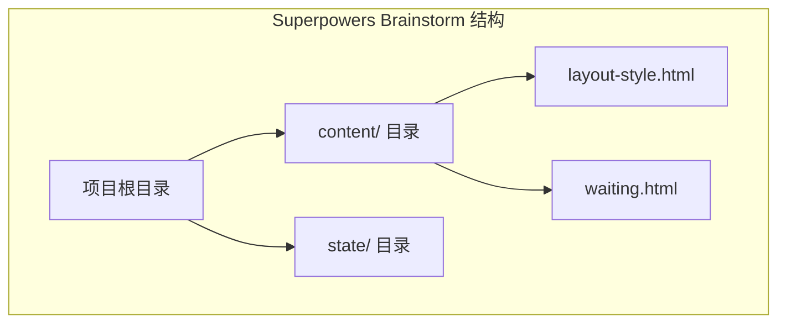
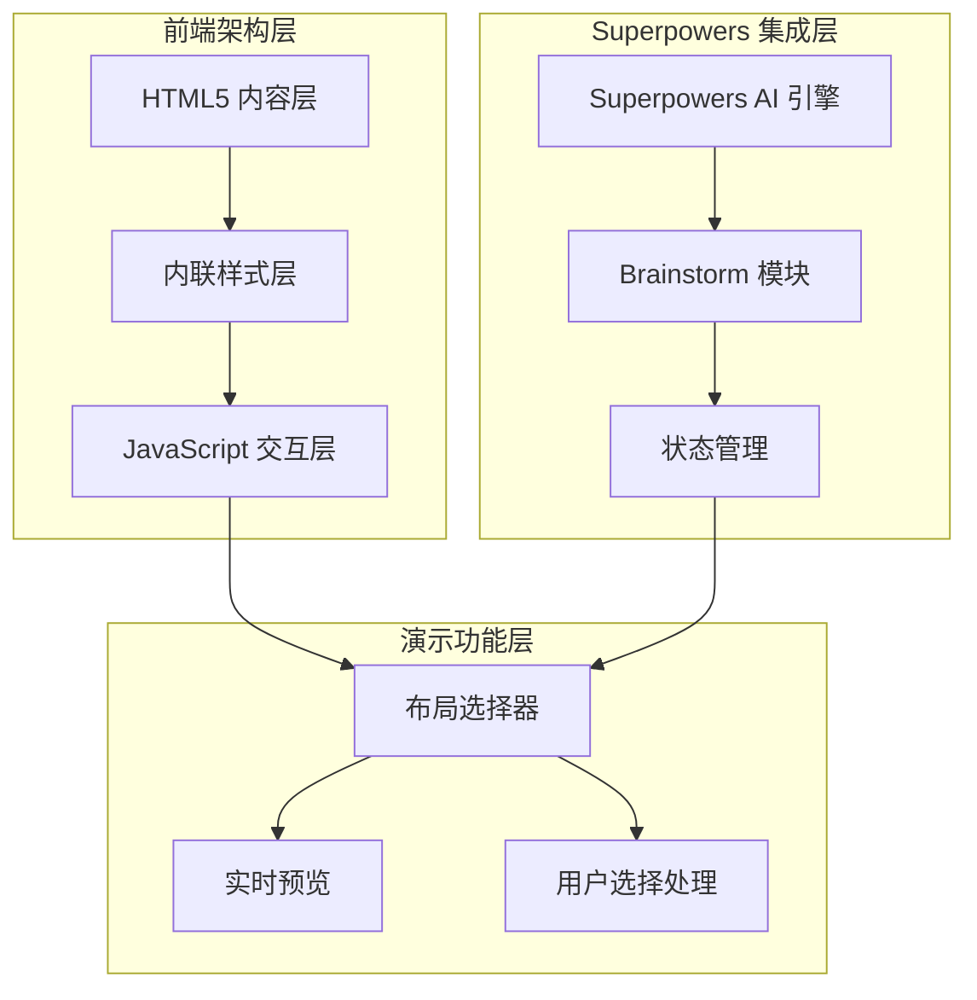
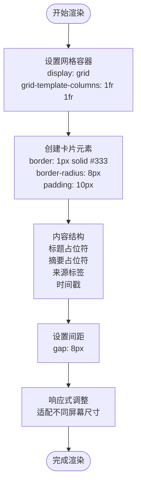
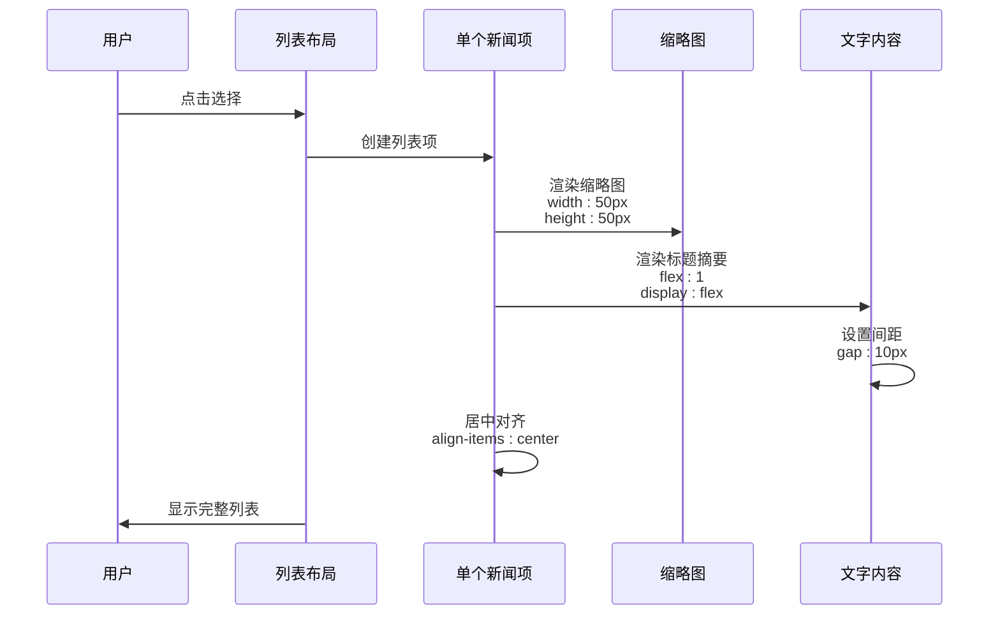
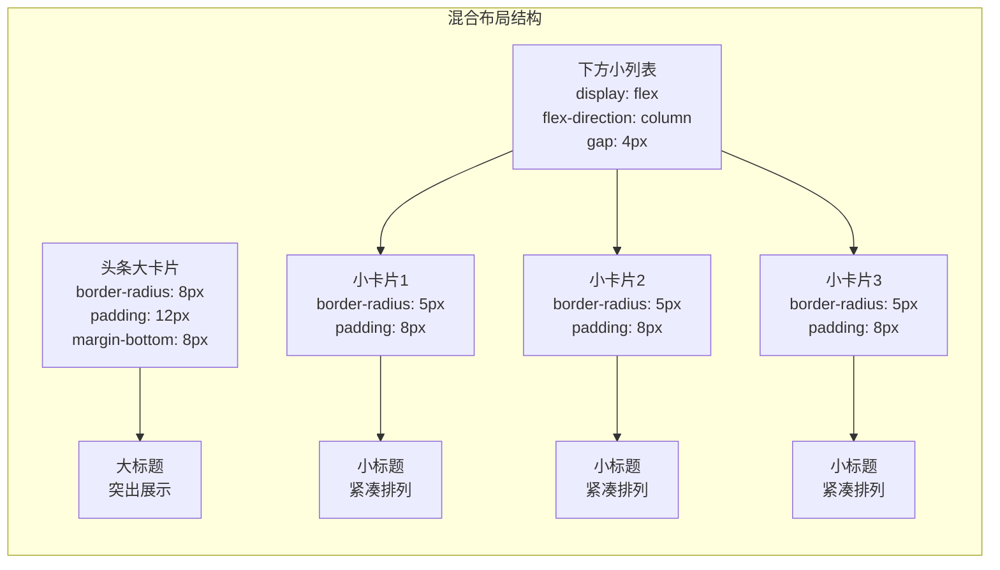
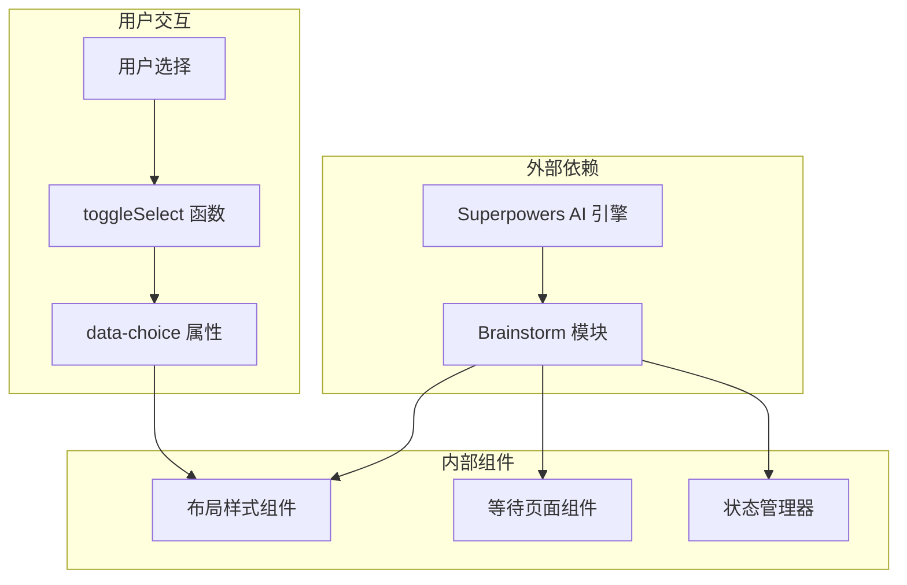

# 项目概述

<cite>
**本文档中引用的文件**
- [layout-style.html](file://.superpowers/brainstorm/1153-1782210686/content/layout-style.html)
- [waiting.html](file://.superpowers/brainstorm/1153-1782210686/content/waiting.html)
</cite>

## 目录
1. [简介](#简介)
2. [项目结构](#项目结构)
3. [核心组件](#核心组件)
4. [架构概览](#架构概览)
5. [详细组件分析](#详细组件分析)
6. [依赖关系分析](#依赖关系分析)
7. [性能考虑](#性能考虑)
8. [故障排除指南](#故障排除指南)
9. [结论](#结论)

## 简介

Next Demo Collection项目是Superpowers AI平台的一个演示模块，专门用于展示和选择不同类型的新闻应用布局风格。该项目通过直观的用户界面让用户能够体验三种不同的新闻内容呈现方式：卡片网格布局、列表流布局和混合布局。该演示模块旨在帮助用户理解不同布局风格在信息密度、可读性和用户体验方面的权衡，从而为实际的新闻应用开发提供参考。

Superpowers AI平台是一个强大的AI驱动的内容创作和管理工具，而Next Demo Collection作为其演示组件，展示了如何利用AI技术来优化用户界面设计和内容展示策略。

## 项目结构

项目采用简洁的文件组织结构，主要包含以下关键组件：

**图表来源**
- [.superpowers/brainstorm/1153-1782210686/content/layout-style.html:1-173](file://.superpowers/brainstorm/1153-1782210686/content/layout-style.html#L1-L173)
- [.superpowers/brainstorm/1153-1782210686/content/waiting.html:1-3](file://.superpowers/brainstorm/1153-1782210686/content/waiting.html#L1-L3)

**章节来源**
- [.superpowers/brainstorm/1153-1782210686/content/layout-style.html:1-173](file://.superpowers/brainstorm/1153-1782210686/content/layout-style.html#L1-L173)
- [.superpowers/brainstorm/1153-1782210686/content/waiting.html:1-3](file://.superpowers/brainstorm/1153-1782210686/content/waiting.html#L1-L3)

## 核心组件

### 布局风格选择器

项目的核心功能是一个交互式的布局风格选择器，允许用户在三种不同的新闻应用布局之间进行选择。每个布局选项都提供了视觉化的预览和详细的描述说明。

#### 主要特性：
- **响应式设计**：支持多种屏幕尺寸和设备类型
- **实时预览**：每个布局选项都有即时的视觉反馈
- **用户友好**：直观的点击选择机制
- **语义化标记**：使用标准的HTML5语义元素

**章节来源**
- [.superpowers/brainstorm/1153-1782210686/content/layout-style.html:1-173](file://.superpowers/brainstorm/1153-1782210686/content/layout-style.html#L1-L173)

## 架构概览

项目采用了轻量级的前端架构设计，主要由静态HTML内容和内联样式组成：

**图表来源**
- [.superpowers/brainstorm/1153-1782210686/content/layout-style.html:1-173](file://.superpowers/brainstorm/1153-1782210686/content/layout-style.html#L1-L173)

### 技术栈

项目采用现代Web技术栈构建：

- **HTML5**: 使用语义化标记和现代HTML5特性
- **CSS3**: 内联样式实现响应式布局和视觉效果
- **JavaScript**: 提供交互功能和用户操作处理

这种技术选择确保了项目的轻量化和高性能，同时保持了良好的跨浏览器兼容性。

**章节来源**
- [.superpowers/brainstorm/1153-1782210686/content/layout-style.html:1-173](file://.superpowers/brainstorm/1153-1782210686/content/layout-style.html#L1-L173)

## 详细组件分析

### 卡片网格布局 (Option A)

卡片网格布局是最具信息密度的布局方式，采用两列的网格系统来展示新闻内容：

**图表来源**
- [.superpowers/brainstorm/1153-1782210686/content/layout-style.html:10-55](file://.superpowers/brainstorm/1153-1782210686/content/layout-style.html#L10-L55)

#### 特点分析：
- **信息密度高**：每行显示两条新闻，最大化空间利用率
- **视觉冲击力强**：卡片形式突出每条新闻的完整性
- **适合内容丰富**：适用于新闻数量较多的场景
- **易于扫描**：网格结构便于快速浏览

### 列表流布局 (Option B)

列表流布局采用经典的资讯应用模式，左侧缩略图配合右侧文字内容：

**图表来源**
- [.superpowers/brainstorm/1153-1782210686/content/layout-style.html:62-115](file://.superpowers/brainstorm/1153-1782210686/content/layout-style.html#L62-L115)

#### 特点分析：
- **阅读体验佳**：垂直滚动符合用户的阅读习惯
- **空间效率高**：相比卡片布局节省垂直空间
- **快速浏览**：适合快速获取新闻概要
- **经典设计**：类似传统资讯应用的布局模式

### 混合布局 (Option C)

混合布局结合了头条新闻的大卡片展示和下方列表的紧凑排列：

**图表来源**
- [.superpowers/brainstorm/1153-1782210686/content/layout-style.html:122-171](file://.superpowers/brainstorm/1153-1782210686/content/layout-style.html#L122-L171)

#### 特点分析：
- **层次分明**：重要新闻突出，次要新闻紧凑排列
- **平衡信息密度**：既保证重点内容的可见性，又保持整体空间效率
- **推荐方案**：项目作者推荐的最优布局选择
- **灵活适应**：适合大多数新闻应用的场景需求

**章节来源**
- [.superpowers/brainstorm/1153-1782210686/content/layout-style.html:5-173](file://.superpowers/brainstorm/1153-1782210686/content/layout-style.html#L5-L173)

## 依赖关系分析

项目具有清晰的依赖关系结构：

**图表来源**
- [.superpowers/brainstorm/1153-1782210686/content/layout-style.html:6-6](file://.superpowers/brainstorm/1153-1782210686/content/layout-style.html#L6-L6)

### 关键依赖点：

1. **Superpowers AI 引擎**：提供AI驱动的内容生成和布局优化能力
2. **Brainstorm 模块**：负责创意生成和布局建议
3. **状态管理**：维护用户选择和偏好设置
4. **用户交互**：通过JavaScript函数处理用户选择

**章节来源**
- [.superpowers/brainstorm/1153-1782210686/content/layout-style.html:1-173](file://.superpowers/brainstorm/1153-1782210686/content/layout-style.html#L1-L173)

## 性能考虑

### 渲染优化

项目采用了多种性能优化策略：

- **内联样式**：减少额外的CSS文件请求
- **语义化HTML**：提高DOM解析效率
- **响应式设计**：避免复杂的JavaScript计算
- **最小化DOM操作**：通过CSS实现大部分视觉效果

### 用户体验优化

- **即时反馈**：点击选择立即产生视觉变化
- **流畅动画**：平滑的过渡效果提升用户体验
- **无障碍设计**：支持键盘导航和屏幕阅读器
- **触摸友好**：适合移动设备的触摸操作

## 故障排除指南

### 常见问题及解决方案

#### 问题1：布局显示异常
**症状**：布局元素错位或重叠
**解决方案**：
1. 检查CSS样式是否正确加载
2. 验证HTML结构的完整性
3. 确认响应式断点设置

#### 问题2：交互功能失效
**症状**：点击选择无响应
**解决方案**：
1. 检查JavaScript函数是否正确绑定
2. 验证事件监听器的设置
3. 确认数据属性的正确性

#### 问题3：内容显示不完整
**症状**：部分新闻内容缺失
**解决方案**：
1. 检查数据源连接
2. 验证API调用权限
3. 确认网络连接状态

**章节来源**
- [.superpowers/brainstorm/1153-1782210686/content/layout-style.html:1-173](file://.superpowers/brainstorm/1153-1782210686/content/layout-style.html#L1-L173)

## 结论

Next Demo Collection项目成功地实现了Superpowers AI平台的布局风格演示功能。通过提供三种精心设计的新闻应用布局选项，该项目为用户提供了直观的布局选择体验，同时展示了现代Web技术的最佳实践。

### 主要成就：

1. **设计理念先进**：三种布局风格代表了当前新闻应用设计的主流趋势
2. **技术实现优雅**：使用纯HTML5和内联样式实现复杂的功能
3. **用户体验优秀**：直观的交互设计和流畅的视觉反馈
4. **扩展性强**：为未来的功能扩展和技术升级预留了空间

### 应用价值：

- **教育意义**：帮助开发者理解不同布局风格的设计考量
- **实用价值**：为实际的新闻应用开发提供参考模板
- **技术创新**：展示了AI驱动的布局优化可能性
- **社区贡献**：为Superpowers AI平台生态系统增添价值

该项目不仅是一个功能完整的演示模块，更是现代Web开发技术和设计理念的完美体现，为后续的开发工作奠定了坚实的基础。